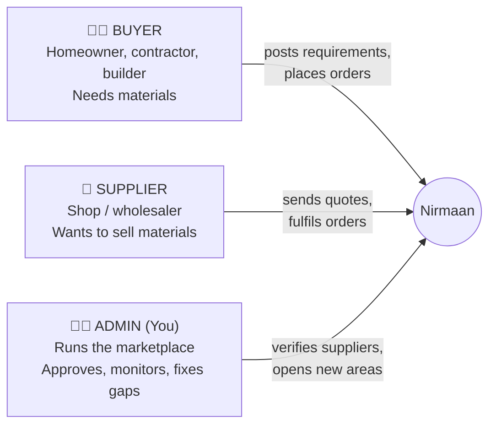
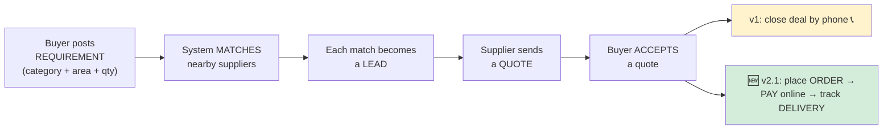
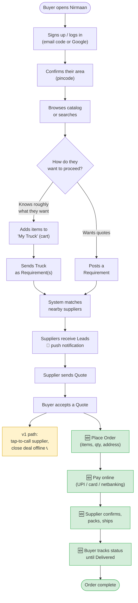
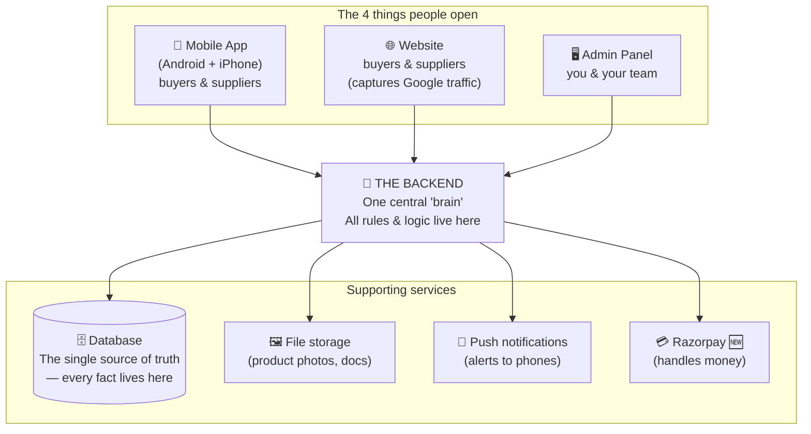
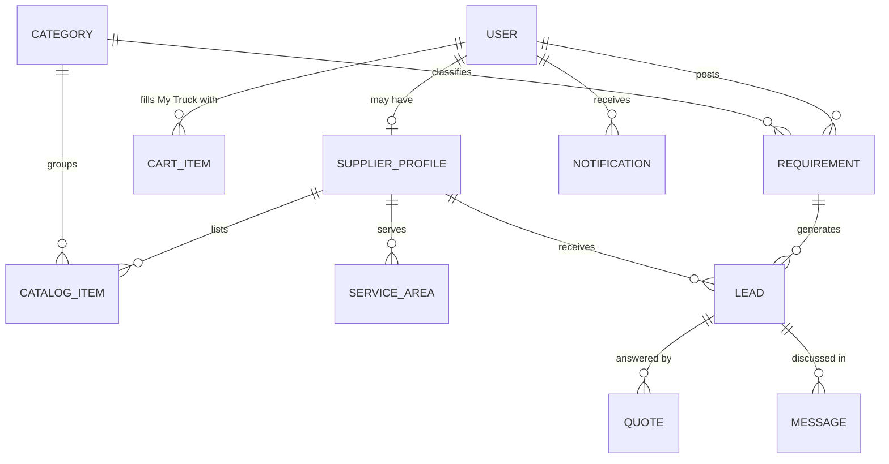
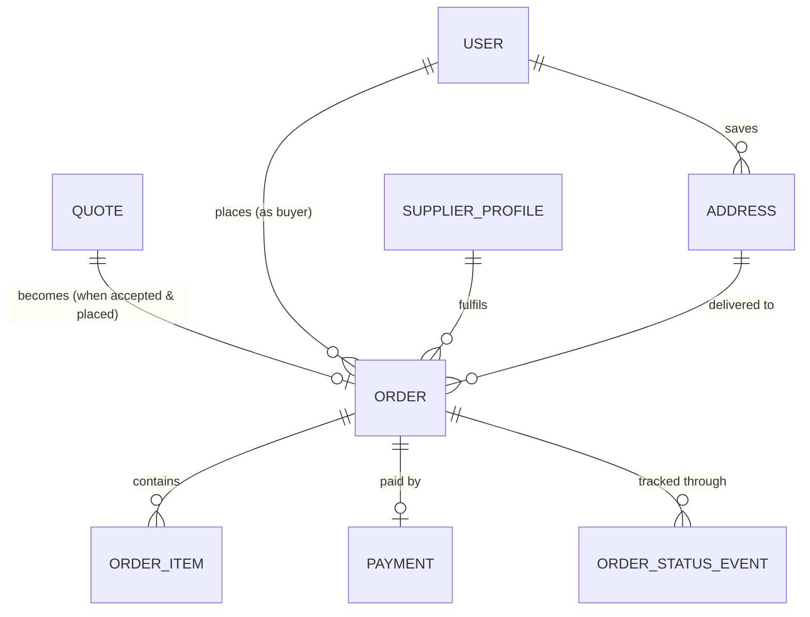
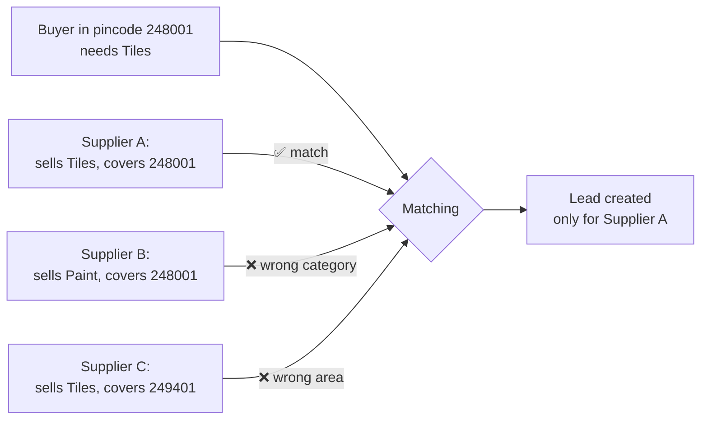
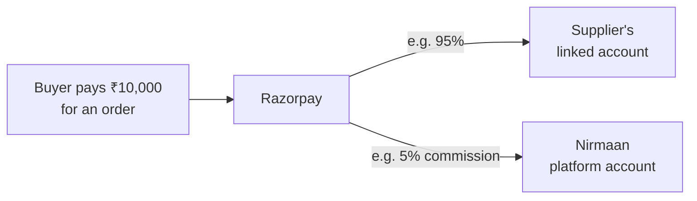
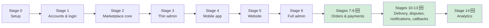

# Nirmaan — The Complete Product & Technology Guide

### Written so a non-technical co-founder can understand the whole thing

**Version:** v1 (core) + v2.1 (everything actually built, clearly marked)
**Launch region:** Dehradun + Haridwar (Uttarakhand)
**Last updated:** June 2026

---

## How to read this document

This is the **master guide**. It explains, in plain language, what Nirmaan is, who uses it, how money and materials flow through it, and how the technology is put together. You do not need a technical background to follow it.

There are four companion documents that go deeper into each piece of software we built. You only need them when you want detail on a specific app:

| Document | What it covers | Who cares most |
|---|---|---|
| **01 — Backend** | The "brain" that every app talks to | Engineers, but the summaries are for everyone |
| **02 — Mobile App** | The main app buyers and suppliers use on their phones | Product, marketing, you |
| **03 — Web App** | The website version (for Google search traffic) | Marketing, growth, SEO |
| **04 — Admin Panel** | The control room you and your team use to run the business | You, operations, support hires |

> **A note on versions.** This project was first scoped as **v1** — a simple "lead-generation" marketplace with no online payments. It then grew into **v2.1**, which added real orders, online payment, delivery tracking, and analytics. Throughout these documents, anything that belongs to the bigger v2.1 build is marked like this:
>
> 🆕 **v2.1** — text describing the newer capability.
>
> Everything not marked is part of the original v1 core.

---

## 1. What is Nirmaan, in one paragraph?

Nirmaan is a **marketplace for construction materials** — tiles, paint, plywood, bathroom fittings, electricals, and so on — for a specific city at a time (we started with Dehradun and Haridwar). A **buyer** (think: a homeowner, contractor, or builder) opens the app, browses materials, and either adds them to a cart called **"My Truck"** or posts a **"Requirement"** describing what they need. Nearby verified **suppliers** (shops and wholesalers) get notified, send back **quotes** (their price), and the buyer picks one. In the original version the deal was then closed by phone. In the newer version 🆕 the buyer can place a real **order**, **pay online**, and **track delivery** — all inside the app.

---

## 2. The three kinds of people who use Nirmaan

Everything in the product exists to serve one of these three audiences. Keep them in mind; the entire design follows from them.

**The buyer** wants the right material, at a fair price, from someone nearby they can trust, with as little hassle as possible.

**The supplier** wants a steady stream of genuine, ready-to-buy customers without spending on advertising.

**The admin (you)** wants the two sides to find each other smoothly, wants only genuine suppliers on the platform, and wants to see where demand is so you know which neighbourhood or material to expand into next.

---

## 3. The core idea: "demand engine," not just a shop

Most people picture an online store like Amazon: fixed prices, add to cart, pay, done. Nirmaan is deliberately **not** that — at least not at its heart. Construction material pricing is negotiated, varies by quantity, and depends on the supplier. So Nirmaan's heart is a **demand engine**:

1. A buyer says *"I need 200 sq ft of vitrified tiles in Dehradun."* — this is a **Requirement** (technically an **RFQ**, "Request for Quote").
2. The system instantly finds suppliers who **sell tiles** AND **serve that pincode**. Each match becomes a **Lead** sent to that supplier.
3. Suppliers reply with a **Quote** (their price and terms).
4. The buyer compares quotes and **accepts** one.

That four-step loop — Requirement → Leads → Quotes → Accept — is the engine. Everything else (the catalog, the cart, payments) feeds into it or extends from it.

**Why this matters commercially:** the single most valuable signal in the whole system is a **Requirement that finds zero suppliers**. That tells you exactly where you have a gap — a material nobody nearby sells, or a neighbourhood with no coverage. That is your to-do list for growth, and the admin panel surfaces it prominently.

---

## 4. The full journey, end to end

Here is the complete path, combining what every person does. Yellow steps are the original v1; green steps are 🆕 v2.1 additions.

---

## 5. How the technology is arranged (the "boxes" diagram)

You do not need to know how software is written to grasp the shape of it. Think of it as **four apps that all talk to one brain, which talks to one database.**

**The single most important design rule:** no app ever touches the database directly. The mobile app, the website, and the admin panel **all** go through the one backend "brain." This is deliberate — it means the rules of the business (who can do what, how matching works, how money is split) are written **once, in one place**, instead of being copied into three apps where they would drift apart and cause bugs.

### Why these specific technology choices? (plain-language version)

| Choice we made | What it is | Why, in business terms |
|---|---|---|
| **PostgreSQL database** (via Supabase) | The system that stores all the facts | Our data is full of relationships (a quote belongs to a lead, which belongs to a requirement). This type of database guarantees those links stay consistent — you can never end up with a "quote for a requirement that doesn't exist." It's also cheap (free tier covers the whole pilot) and easy to manage with a visual editor. |
| **One backend, modular inside** | The "brain," built in neat sections | Cheaper and simpler to run than splitting it into many pieces, but organised internally so we *can* split it later when we're big — without a rewrite. |
| **React Native** for mobile | A way to build Android + iPhone apps from one codebase | We write the app once and it runs on both Android and iPhone — roughly half the cost and time of building two separate apps. |
| **Next.js** for web & admin | A modern website framework | It produces pages that Google can read and rank, which is central to our cheap-customer-acquisition strategy. |
| **Razorpay** 🆕 for payments | India's standard payment gateway | Handles UPI, cards, and netbanking, and can automatically split each payment between us (commission) and the supplier. |

---

## 6. The data model — the "nouns" of the business

Every piece of software is built around a handful of core "things" (engineers call them entities or tables). If you understand these nouns and how they connect, you understand the system. Here they are in plain English.

| The "thing" | In plain English | Connects to |
|---|---|---|
| **User** | A person. Can be a buyer, a supplier, or both. | Owns requirements, a cart, and (if a supplier) a business profile |
| **Serviceable Area** | A pincode we've switched on. The unit of our launch strategy. | Buyers belong to one; suppliers cover several |
| **Supplier Profile** | A shop's business details (name, GST number, verified badge) | Belongs to a user; lists catalog items; covers areas |
| **Category** | A type of material (Tiles, Paint, Plywood…) | Groups catalog items and requirements |
| **Catalog Item** | One product a supplier lists (e.g. "Vitrified Tiles 2x2 ft") | Belongs to a supplier and a category |
| **Requirement (RFQ)** | A buyer's posted need | Generates leads |
| **Lead** | One requirement shown to one matched supplier | Belongs to a requirement + a supplier; may get a quote |
| **Quote** | A supplier's price offer on a lead | Belongs to a lead |
| **Cart Item ("My Truck")** | A saved product before buying | Belongs to a user |
| **Message** | A chat note between buyer and supplier | Belongs to a lead |
| **Notification** | An alert (push or in-app) | Belongs to a user |
| 🆕 **Address** | A buyer's delivery address | Belongs to a user; used by orders |
| 🆕 **Order** | A confirmed purchase | Belongs to buyer + supplier; has order items |
| 🆕 **Order Item** | One line inside an order | Belongs to an order |
| 🆕 **Payment** | A money transaction via Razorpay | Belongs to an order |

Here's how the original v1 "nouns" relate to each other:

And here is what 🆕 v2.1 added on top — the transactional layer that turns an accepted quote into a paid, delivered order:

---

## 7. The two big "cross-cutting" ideas

A couple of concepts show up in every single app, so they're worth understanding once, here.

### 7.1 Geofencing — "we launch one pincode at a time"

Nirmaan does not open everywhere at once. We switch on **one pincode at a time**, the way Swiggy or Zomato light up neighbourhoods. A pincode that's switched on is a **Serviceable Area**.

- Buyers can only post requirements from a switched-on area.
- Suppliers declare which pincodes they cover.
- Matching only ever connects a buyer and supplier in the **same** area and **same** material category.
- You control which pincodes are live entirely from the **admin panel** — opening a new neighbourhood needs no engineering work, just a click.

### 7.2 Language — English + Hindi

The app supports English and Hindi. There are two different kinds of "translation," and we treat them differently to keep costs near zero:

- **Fixed labels** (buttons, tab names like "My Truck") — translated once in files shipped with each app. Free.
- **Category names** and the Help/Privacy/Terms pages — stored in the database in both languages, because there are few of them and you write them yourself.
- **Free text people type** (requirement descriptions, chat, product titles a supplier wrote) — shown exactly as typed, **not** auto-translated in v1. Real-time translation of arbitrary text is expensive and most people in one city share a working language, so it was deliberately left for later.

A safety rule the backend enforces: **if a Hindi translation is ever missing, show the English one** — never a blank screen.

---

## 8. How we make money 🆕

In the original v1, Nirmaan made no money directly inside the app — it generated leads and the value was in connecting people. In **v2.1**, with real orders and payments, the revenue model became concrete:

- Every paid order goes through **Razorpay**.
- Razorpay's **Route** feature **automatically splits** each payment at the moment of purchase: the **supplier's share** goes to the supplier's linked bank account, and **our commission** stays with the platform.
- The commission percentage is a setting we control.

> There are open operational decisions around this (per-supplier bank account setup, how "call me back" payment links are split). Those are tracked in the project's pending-review list, not blockers to the core flow.

---

## 9. What we deliberately did NOT build

A huge part of keeping a first version shippable is being disciplined about what to leave out. These were **intentionally** excluded (they're not bugs or oversights):

- Cash on delivery, our own lending / "buy now pay later"
- Live GPS van tracking (we use a manual status timeline instead)
- Automatic refunds and an automated dispute-rules engine (a human resolves disputes)
- Ratings & reviews
- Automatic supplier document verification (you verify your first suppliers by hand, on purpose, so you learn what actually matters)
- A full desktop-redesigned website / installable web app
- Multi-currency / international

The principle: **don't build sophistication before you have the volume that justifies it.**

---

## 10. Where the project stands today

The build was structured in **15 stages (0–14)**, each one finished and runnable before the next began, so the four apps never drifted out of sync. As of the latest review:

- **All 15 stages are complete** and type-checked. The product is feature-complete: catalog, requirements, matching, quotes, cart, orders, payments, delivery tracking, disputes, notifications, and analytics dashboards all exist.
- What remains is **operational setup**, not building: plugging in real credentials (Razorpay live keys, push-notification service, email), installing a couple of phone-specific components, and a short list of small decisions. These are tracked in the pending-review backlog.
- Everything was verified by automated checks in a sandbox; the final hands-on testing (real database, real test payments, on-device UI) happens on your machine.

---

## 11. Glossary — every term in one place

| Term | Plain meaning |
|---|---|
| **RFQ / Requirement** | A buyer's posted "here's what I need" |
| **Lead** | That requirement delivered to one matched supplier |
| **Quote** | A supplier's price offer |
| **My Truck** | The shopping cart (named playfully; icon grows from cart → pickup → truck as it fills) |
| **Serviceable Area** | A pincode we've switched on |
| **Geofencing** | Restricting the marketplace to switched-on pincodes |
| **Catalog Item** | A single product a supplier lists |
| **Category** | A material type (Tiles, Paint…) |
| **Supplier Profile** | A shop's business record, with the verified badge |
| **Backend / "the brain"** | The central software all apps talk to |
| **Frontend** | Anything a person looks at and taps (the apps and website) |
| **Database** | Where all facts are permanently stored |
| **API** | The defined "menu" of requests an app can make to the backend |
| **SSR / SEO** | Building web pages so Google can read and rank them |
| 🆕 **Order** | A confirmed purchase |
| 🆕 **Razorpay** | The payment company that processes money & splits it |
| 🆕 **Route / split** | Razorpay automatically dividing a payment between supplier and us |
| 🆕 **Webhook** | Razorpay phoning our backend to say "this payment succeeded" |
| 🆕 **Dispute** | A logged complaint about an order, resolved by a human |
| 🆕 **Analytics rollup** | A nightly job that totals up demand so dashboards are fast |

---

*Continue to the four companion documents for detail on each app.*
