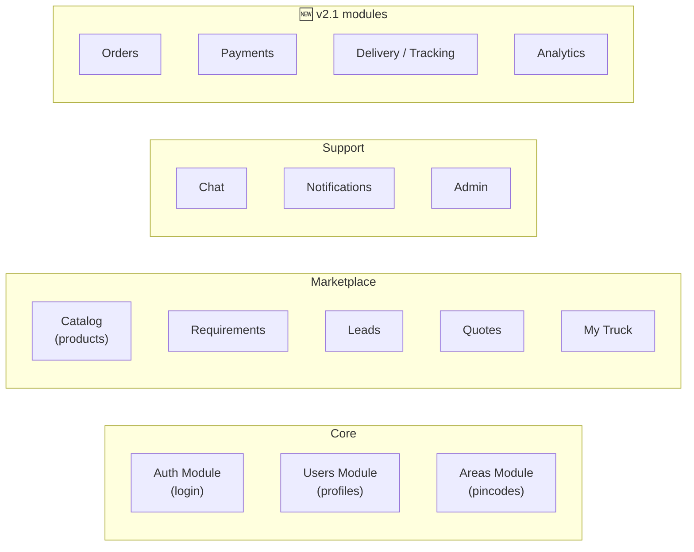
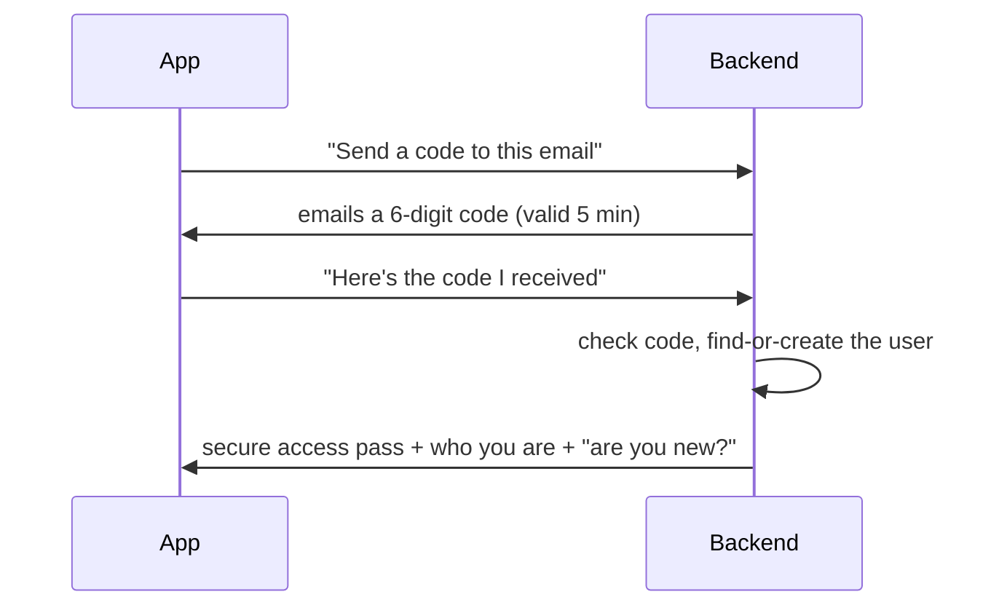
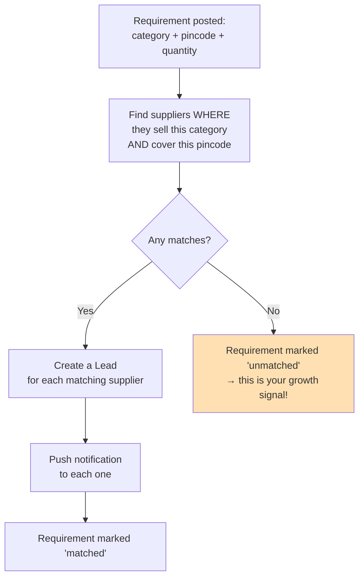
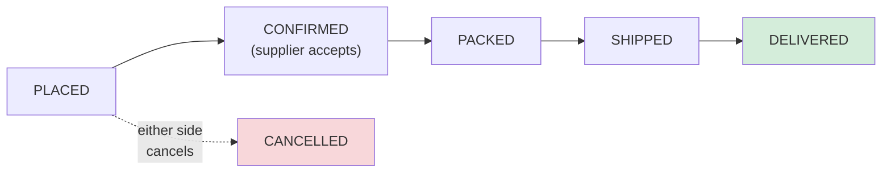
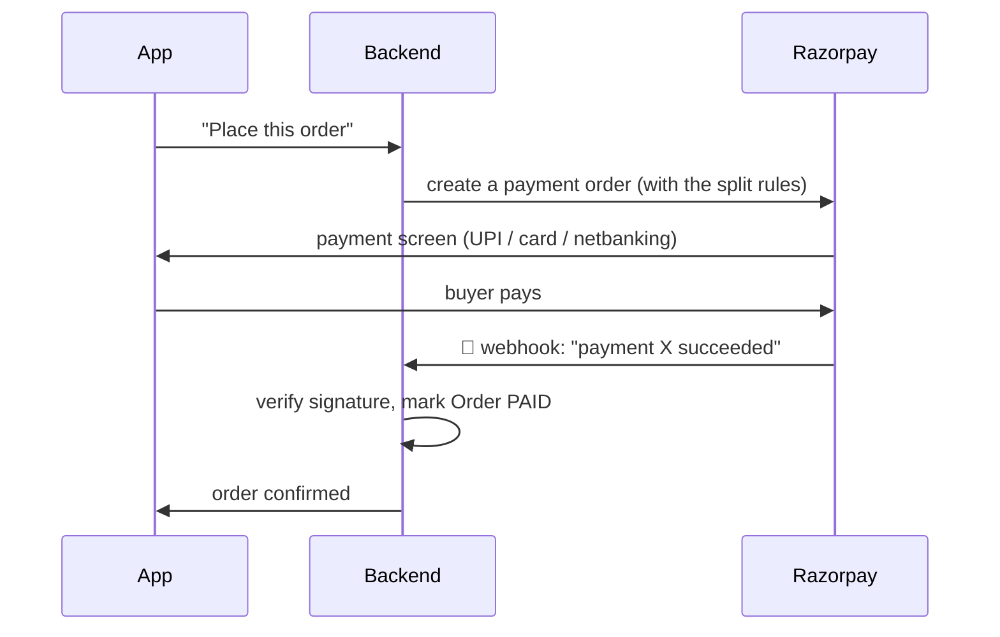

# 01 — The Backend ("The Brain")

### A detailed but readable guide to the central system every app talks to

> **For non-technical readers:** each section opens with a plain-language **"In plain English"** box. You can read just those boxes and come away understanding the whole backend. The detail beneath is for engineers.

---

## 1. What the backend is and why it exists

> **In plain English:** The backend is the single "brain" of Nirmaan. The mobile app, the website, and the admin panel are just *faces* — when you tap a button, they send a message to the backend, which decides what's allowed, does the work, saves the result, and sends an answer back. Crucially, **all the real rules of the business live here and only here.** That's why a buyer on the website and a buyer on the phone behave identically: they're both asking the same brain.

The backend is a single program (a "modular monolith") that serves the mobile app, the web app, and the admin panel through one **versioned REST API**. No client ever talks to the database directly — everything goes through here. It is organised internally into clean modules, each owning one area of the business.

**Why one program and not many small ones?** At our scale — one region, thousands of users — splitting into many independent services would add cost and debugging headaches for no benefit. The internal module boundaries mean we *can* split later when we're large, without a rewrite. We don't pay that price now.

---

## 2. Logging in (the Auth module)

> **In plain English:** Two ways to get in: a **6-digit code emailed to you**, or **"Continue with Google."** There's no separate "sign up" vs "log in" — if you're new, the system quietly creates your account; if you're returning, it recognises you. After a brand-new login we ask for just two things — your **name** and your **area (pincode)** — before letting you into the app. Behind the scenes, the system hands your app a secure "pass" (a token) that proves who you are on every later request, so you don't re-enter your code constantly.

### How email-code login works

Google login works the same way, except Google vouches for the user's identity instead of an emailed code.

### The "menu" of login requests (API contract)

| Request | What it does | Notes |
|---|---|---|
| `POST /auth/otp/request` | Ask for an email code | Limited to 3 per hour per email (anti-abuse) |
| `POST /auth/otp/verify` | Submit the code, get your pass | Tells the app if you're a new user (→ show onboarding) |
| `POST /auth/google` | Log in with Google | Same result shape |
| `POST /auth/refresh` | Quietly renew an expired pass | So the user isn't logged out |
| `POST /auth/logout` | Log out | Invalidates the renewal pass |

**The security detail that matters:** the "access pass" expires every 15 minutes and is silently renewed using a longer-lived "refresh pass" (30 days) that we store in a scrambled form so it can be revoked if needed. This is standard, safe practice.

**Onboarding is enforced by the brain, not just the app:** until a new user has set both their name and pincode, the backend itself refuses most requests. This means nobody can skip onboarding by using a different app or a hack — the rule lives in the one place that can't be bypassed.

---

## 3. Profiles and areas (Users & Areas modules)

> **In plain English:** Your profile holds your name, your area, and whether you're a buyer, a supplier, or both. Changing your area is a one-tap action (like "deliver to" on a food app) because people switch neighbourhoods often. The Areas module is what powers the area-picker: it can tell the app "yes, we serve pincode 248001" or "not yet."

| Request | What it does |
|---|---|
| `GET /users/me` | Get my profile and roles |
| `PATCH /users/me` | Update name, pincode, or flip "I'm a supplier" on |
| `PATCH /users/me/area` | Change my area (its own request because it's so frequent) |
| `GET /areas/check?pincode=` | "Do you serve this pincode?" — used before letting someone pick it |
| `GET /areas/active` | List of all live pincodes for the picker |

🆕 **v2.1 — Become a Supplier with a business location.** When a buyer registers their shop, the backend captures their business pincode and (optionally) map coordinates via `PATCH /supplier/profile`. *(Note: this was a planned sub-item; see the pending-review backlog for its build status and the maps-pin UI.)*

---

## 4. The catalog (browse & search)

> **In plain English:** This module powers everything a buyer sees while browsing: the grid of material categories, the list of products in a category, and — importantly — the **search bar that shows 4 helpful suggestions the moment you tap it**, before you've typed anything. All product listings are automatically filtered to the buyer's current area, so you only ever see what's actually available near you.

| Request | What it does |
|---|---|
| `GET /categories?locale=` | The category grid, in the right language, in display order |
| `GET /categories/:id/suggestions?q=` | Powers the 4 search suggestions |
| `GET /catalog?category=&pincode=&q=` | Search products, filtered to the area |
| `GET /catalog/:id` | One product's full detail |
| `POST/PATCH/DELETE /supplier/catalog` | A supplier manages their own listings |

**The "4 suggestions" feature** (a specific founder requirement) returns a tidy mix of matching categories and products. When you tap one, you land on that category page, pre-filtered. The "show exactly 4" rule lives in the backend (adjustable by a setting), not hidden in the app — so it stays consistent across phone and web.

**One translation rule, written once:** there's a single shared helper that decides "show the Hindi name if it exists, otherwise the English one." It is reused everywhere a translated label is read. Writing it once is how we avoid language bugs creeping in screen by screen.

---

## 5. The demand engine (Requirements, Leads, Quotes)

> **In plain English:** This is the heart of Nirmaan. A buyer posts a **Requirement** ("I need X in area Y"). The instant they do, the system finds every supplier who sells that material AND covers that area, and creates a **Lead** for each — like dealing one card to each matching supplier. Those suppliers get a phone notification, reply with a **Quote** (their price), and the buyer accepts the one they like.

### Requirements

| Request | What it does |
|---|---|
| `POST /rfqs` | Post a requirement → **immediately triggers matching** |
| `GET /rfqs` | A buyer's own requirements |
| `GET /rfqs/:id` | One requirement with its leads and quotes |
| `PATCH /rfqs/:id` | Edit or cancel while still open |

### The matching logic — the engine's core

This runs **instantly** (not in a background queue) because the number of suppliers in any one pincode is small. We deliberately did **not** build heavy queueing infrastructure before the volume needs it.

### Leads (the supplier's side)

| Request | What it does |
|---|---|
| `GET /leads?status=` | A supplier's incoming leads |
| `GET /leads/:id` | Lead detail (buyer's contact appears once a quote is sent) |
| `PATCH /leads/:id/view` | Mark as seen |
| `PATCH /leads/:id/decline` | Pass on it |

### Quotes

| Request | What it does |
|---|---|
| `POST /leads/:id/quotes` | Supplier sends a price → buyer gets notified |
| `PATCH /quotes/:id/accept` | Buyer accepts → unlocks contact / 🆕 enables ordering |
| `PATCH /quotes/:id/reject` | Buyer declines |

🆕 **v2.1 — the moment of acceptance does more now.** Accepting a quote fires an internal alert to your team (so a deal can be closed by phone if needed) and, in the full transactional flow, becomes the basis for placing a real **Order** at the agreed price.

### The status "life stories"

Each of these three things moves through a defined set of stages — useful to know because the admin dashboard reports on them:

- **Requirement:** open → matched → quoted → closed → expired
- **Lead:** pending → viewed → quoted → declined → expired
- **Quote:** sent → accepted → rejected → expired

---

## 6. My Truck (the cart)

> **In plain English:** "My Truck" is the shopping cart. The fun part — the icon growing from a cart to a pickup to a full truck as you add more — is decided by the *apps*, not the brain. The backend just reports "you have 7 items worth roughly ₹X"; each app decides which icon to show. This keeps the brain simple and the playfulness where it belongs.

| Request | What it does |
|---|---|
| `GET /cart` | Items + total count + estimated value |
| `POST /cart` | Add an item |
| `PATCH/DELETE /cart/:itemId` | Change quantity / remove |

---

## 7. Chat and notifications

> **In plain English:** Once a quote is in play, buyer and supplier can exchange short messages tied to that lead, and there's a one-tap "call" that opens the phone dialer with the supplier's number (we deliberately did **not** build calling *inside* the app — that's needless complexity). Notifications are a simple shared service any part of the brain can use to "ping" a user, both as a phone push and an in-app alert.

| Request | What it does |
|---|---|
| `GET /leads/:id/messages` | Chat history for a lead |
| `POST /leads/:id/messages` | Send a message (or a "request a callback") |

🆕 **v2.1 — Notifications got a full read-side:** users can list notifications, see an unread count, and mark them read. Every important event (a new lead, a quote, an order update) creates a notification row. "Live while the app is open" is currently done by the app **checking every 15–20 seconds** (polling), because a true always-on push channel needs extra infrastructure that's noted in the backlog.

---

## 8. 🆕 v2.1 — Orders, Payments & Delivery

> **In plain English:** This is the big addition that turned Nirmaan from a "matchmaker" into a real store. Once a buyer has an accepted quote (or a fixed-price cart), they can place an **Order** to a delivery **Address**, **pay online** through Razorpay, and then watch the order move through stages — confirmed, packed, shipped, delivered — like tracking any parcel. If something goes wrong, they can raise a **dispute**, which a human on your team resolves.

### The order lifecycle

### How online payment works (the safe version)

A common worry is "what if the app *says* paid but the money didn't go through?" The design prevents that by **trusting Razorpay's own confirmation**, not the app's:

The **webhook** (Razorpay phoning our backend directly) is the source of truth — even if the buyer closes the app at the wrong moment, the order still gets correctly marked paid. Razorpay's **Route** feature splits the money at this point: the supplier's share to their account, our commission to ours.

### Delivery tracking

There's no live GPS van (deliberately out of scope). Instead, the supplier advances the order through the stages above, and each change is recorded as a timestamped event the buyer can see. The driver's phone number is included in a note on the dispatch step.

### Disputes

Raising a dispute creates a separate record (it doesn't freeze the order's tracking). A human resolves it — there's no automated refund engine in this version, by design.

### "Call me back" payment links 🆕

For buyers who'd rather finish on a phone call, your team can generate a **Razorpay payment link** from their cart. The buyer pays the link, and that triggers order creation. A few rules apply (one supplier per order, the buyer's default address is used, items can only have quantities edited on the call) — all tracked in the backlog.

---

## 9. 🆕 v2.1 — Analytics (the growth dashboards)

> **In plain English:** Every night, the system quietly totals up the day's activity — how many searches, requirements, and orders happened in each area and category — and stores those totals so the dashboards load instantly. The centrepiece is **"Demand by Area,"** which shows you, ranked, where people want things, including pincodes you don't serve yet. That's your expansion map.

A nightly job buckets activity into daily totals per area and per category. The dashboards then read those pre-computed totals rather than crunching raw data live (which would be slow). A few known limitations — the "map" is a ranked list rather than a true geographic map for now, and totals are bucketed by UTC day — are documented in the backlog and don't affect the overall trend picture.

---

## 10. The rules that apply to every request (non-functional requirements)

> **In plain English:** These are the "house rules" the brain follows on every single request, no matter which module — the equivalent of a building's safety codes.

| Concern | The rule |
|---|---|
| **Security** | Every request except login and area-check requires a valid pass (JWT) |
| **Anti-abuse** | The code-request and search endpoints are rate-limited |
| **Input checking** | Every request's data is validated at the door; bad input is rejected immediately |
| **Logging** | Structured logs with a request ID, so any issue can be traced |
| **Consistent errors** | Every error comes back in the same shape, so apps handle them uniformly |
| **Secrets** | Passwords and keys live in environment config, never in the code |

---

## 11. Summary for a co-founder

The backend is the one place where Nirmaan's rules live. It handles **who you are** (auth), **where you are** (areas), **what's for sale** (catalog), the **demand engine** (requirements → leads → quotes), the **cart**, and — in v2.1 — **orders, payments, delivery, and analytics**. Every app is just a window onto this brain. If you remember one thing: *the business logic is written once, here, so the three apps can never disagree about how Nirmaan works.*
