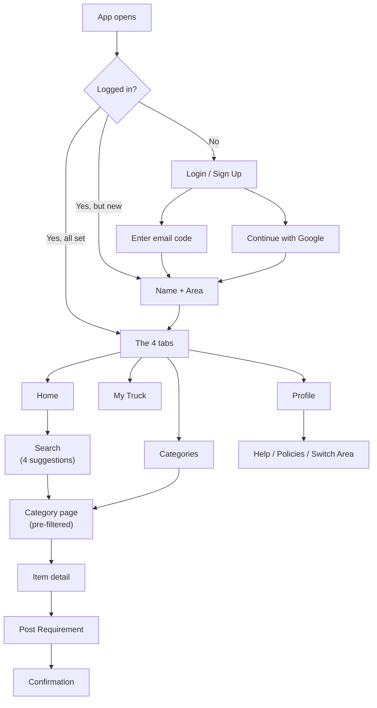
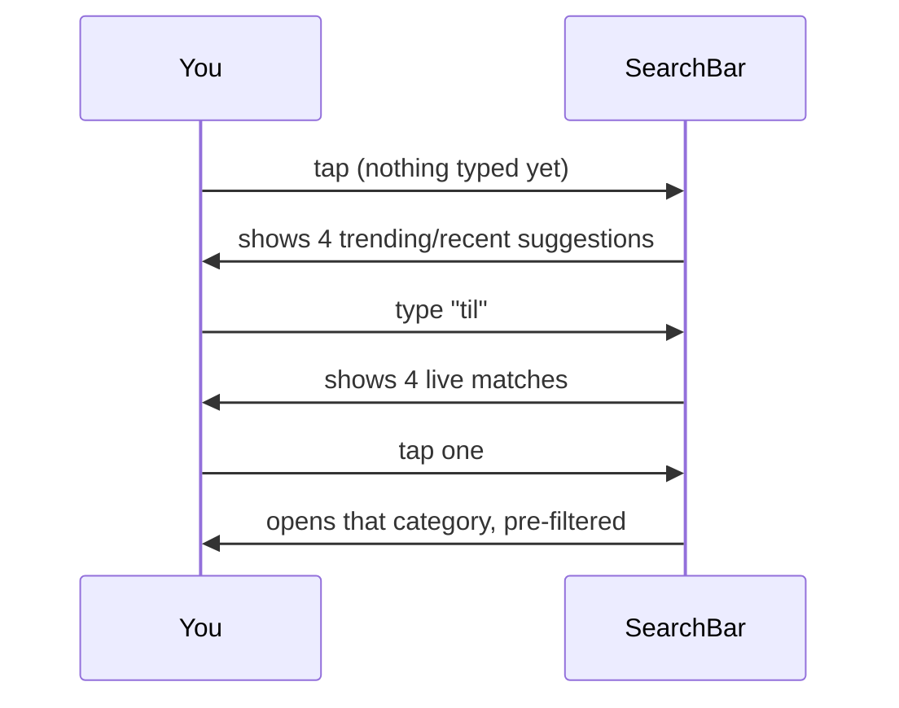
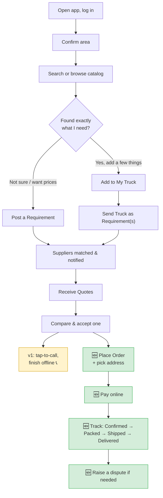
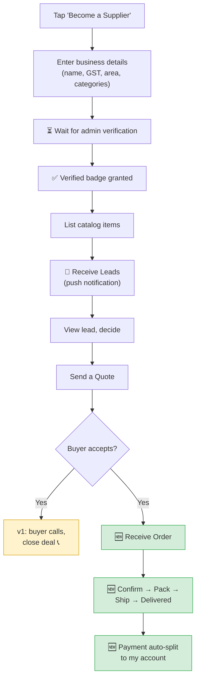

# 02 — The Mobile App

### The main product: what buyers and suppliers see and do on their phones

> **For non-technical readers:** this is the app your customers actually hold in their hands. It's built once and runs on both **Android and iPhone**. Android ships first because that's where most of our users are. Below, every screen is described in plain language, followed by the buyer's and supplier's complete journeys.

---

## 1. Why the mobile app is the "primary surface"

The phone app is where the real product lives. People in construction are on-site, on their phones — not at a desk. Everything is designed for one-handed, quick, "I need this material now" use. The website (document 03) exists mainly to capture Google traffic; the app is where engaged users live.

**Built with React Native:** one codebase produces both the Android and iPhone apps, roughly halving the cost and time versus building each separately. Android is released and QA'd first; iPhone follows.

---

## 2. How you move around the app

> **In plain English:** After logging in, the app has **four tabs along the bottom** — Home, Categories, My Truck, and Profile — exactly like Instagram or WhatsApp's bottom bar. You spend your whole time moving between these four.



---

## 3. Every screen, in plain language

### 3.1 Login / Sign Up — one screen, no friction

> A single screen. Type your email and tap "Send Code," **or** tap "Continue with Google." We deliberately do **not** ask "are you new or returning?" — the system figures that out. New users flow into onboarding; returning users go straight in. The 6-digit code auto-fills where the phone allows, with a 30-second resend timer. A wrong code shows quiet red text under the boxes, not an alarming popup — keeping you in the flow.

### 3.2 Onboarding — only for brand-new users

> Just **two fields on one screen: Name and Area (pincode)**. The area field is the exact same picker used in the header later — built once, reused everywhere. This is also the natural moment to offer the English/Hindi toggle.

### 3.3 The header — always visible

> Across the top of every tab: the **Nirmaan logo**, your **current area** (e.g. "📍 Dehradun ▾" — tap to switch neighbourhoods), and your **name** (tap to jump to Profile). Switching your area instantly re-filters everything you see to that pincode.

```
┌─────────────────────────────────────────────┐
│  [Logo] Nirmaan      📍 Dehradun ▾      👤 Rohit │
└─────────────────────────────────────────────┘
```

### 3.4 Home tab

> The **search bar sits at the top and opens with 4 suggestions** the moment you tap it — before you type a thing (recent or trending choices), then live results as you type. Below it: a quick grid of category icons, then "Popular near you" products filtered to your area.



### 3.5 Categories tab

> This screen **is** a search bar at the top, plus a scrollable grid of all categories below for browsing without typing. Tapping any category opens its page.

### 3.6 Category page

> A filtered list of products in that category and your area. Each card shows: title, unit, price estimate, supplier name, and two actions — **"Add to Truck"** and **"Post Requirement instead."** A persistent banner at the top — **"Can't find it? Post a Requirement"** — is never buried, because posting a requirement is our core demand engine.

### 3.7 Post Requirement (the demand engine entry)

> A short form, **four fields maximum**: Category (pre-filled if you came from a category), Description, Quantity + Unit, and confirm your Area. Submit and you get an **honest** confirmation — "We've notified suppliers near you" — never a false promise of instant delivery.

### 3.8 My Truck tab (the playful cart)

> Your cart, with the signature touch: the **icon grows with the load**, while the label always stays "My Truck."

| Items in cart | Icon shown |
|---|---|
| 0 | empty cart outline ("My Truck is empty") |
| 1–5 | 🛺 hand-cart / "Bailgadi" |
| 6–15 | 🛻 pickup |
| 16+ | 🚛 full truck |

> Each item has a quantity stepper and a line **estimate** (never "total price" — these are negotiated materials, so we always say "estimated value" to avoid implying a fixed checkout). The main button, **"Send as Requirement,"** turns your cart into requirements (grouped by category).
>
> 🆕 **v2.1:** for fixed-price items, the cart can also lead into a real **checkout** — choose an address, place the order, and pay.

### 3.9 Profile tab

> Your name and contact at the top, then: **Become a Supplier** (if you aren't one), **My Requirements** (your history), My Truck history, **Help & Support**, **Privacy Policy**, **Terms of Service**, Switch Area, and Logout.
>
> 🆕 **v2.1:** also **My Orders** (with live status tracking) and saved **Addresses**.

---

## 4. The complete BUYER journey

> **In plain English:** here's everything a buyer does, start to finish, combining v1 and v2.1.



---

## 5. The complete SUPPLIER journey

> **In plain English:** a supplier is just a user who tapped "Become a Supplier." Once verified by you (the admin), they list products, receive leads, quote, and — in v2.1 — fulfil orders.



---

## 6. Things that make the app feel good (cross-cutting decisions)

> **In plain English:** a few deliberate choices that separate a "cheap-feeling" MVP from a "smooth" one.

| Decision | Why it matters |
|---|---|
| **Skeleton loaders, not spinners** | Showing a grey outline of content that's loading *feels* faster than a spinning wheel |
| **One shared component library** | Buttons, inputs, and cards look identical on every tab — inconsistency is the #1 way apps feel cheap |
| **Push notifications deep-link** | Tapping a "new lead" notification jumps straight to that lead, not the home screen |
| **Tap-to-call, not in-app calling** | Opens the normal phone dialer — building voice calling into the app was needless complexity |
| **Honest expectation-setting** | Requirement confirmations never imply instant magic; trust matters in construction |

---

## 7. What the app deliberately leaves out

- iPhone-only features or design differences (parity with Android instead)
- Fingerprint/face login
- In-app voice calling
- Quick-reply directly from a notification (open the app instead)

---

## 8. The technical bits worth knowing (for engineers)

- **React Native** with **React Navigation** (bottom tabs + a stack per tab).
- **State:** React Query for data from the backend, lightweight Zustand for on-screen UI state.
- **Push:** Firebase Cloud Messaging.
- 🆕 **Payments:** the Razorpay React Native component (needs installing and native-linking on a dev machine before the payment screen activates — until then it shows "payment not available in this build").
- 🆕 **Deep links:** `nirmaan://pay/...` links are configured; the OS-level registration is a remaining native setup step, with the website's pay page as a working fallback in the meantime.

---

## 9. Summary for a co-founder

The mobile app is four simple tabs — **Home, Categories, My Truck, Profile** — wrapped around one core action: **post a requirement and get quotes**. A buyer browses or searches, posts what they need, and picks a quote. A supplier gets leads and responds. In v2.1, that extends all the way to placing orders, paying, and tracking delivery. The whole thing is engineered to feel *smooth and trustworthy*, because in construction, trust is the product.
