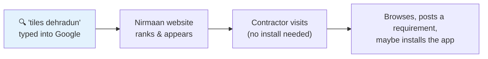
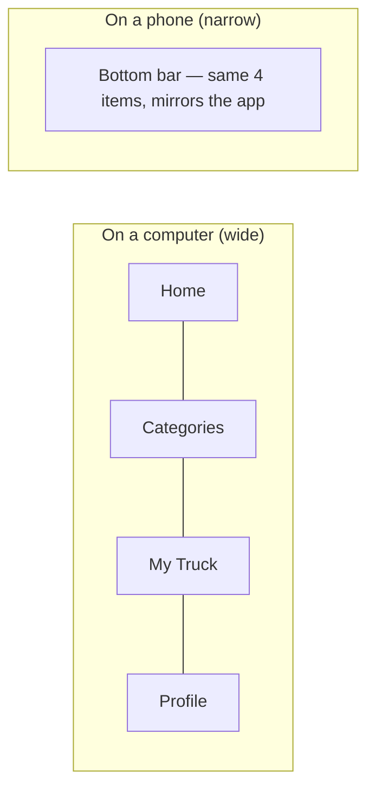
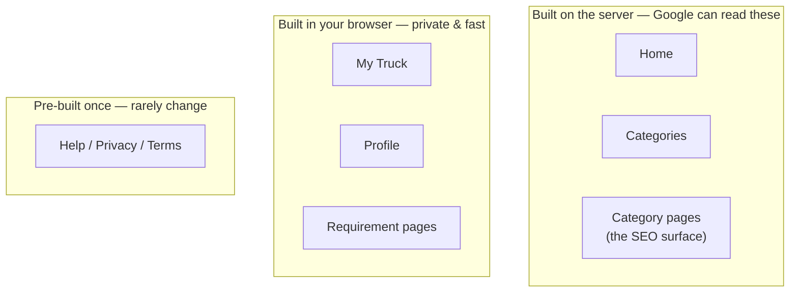
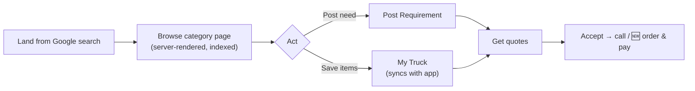

# 03 — The Web App (Website)

### The same product as a website — and our cheapest customer-acquisition channel

> **For non-technical readers:** this is nirmaan.app in a browser. It does the same things as the phone app, but it exists for one extra, important reason: **Google.** When a contractor types "tile wholesalers Dehradun" into Google at 11pm, we want Nirmaan to show up — and only a real website can do that. The app can't.

---

## 1. Why a website at all, when we have an app?

Two reasons, both about getting customers cheaply:

1. **Search traffic (SEO).** People search Google for local materials — "plywood dealers Haridwar," "bathroom fittings Dehradun." Those searches are free, intent-rich customers. A website can rank for them; an app cannot. This is a **compounding** channel: it gets better over time at no extra cost.
2. **No-install entry.** Some people will try us in a browser before committing to installing an app. The website lets them.

---

## 2. "Mobile-first," even on the web

> **In plain English:** even though it's a website, most visitors will be on a **phone browser**, not a laptop. So we design every page to look great on a narrow phone screen *first*, then let it stretch comfortably to desktop — not the other way around.

The website is built to look and behave like the app on a phone, and reflow sensibly on bigger screens. We do **not** build a separate fancy desktop layout in v1 — that's a later nicety.

---

## 3. How you move around the website

> **In plain English:** the exact same four sections as the app — Home, Categories, My Truck, Profile. On a phone browser they appear as a bottom bar (just like the app); on a desktop they appear as a top menu. Same four items, shown two ways.

A nice efficiency: we keep **one** navigation list and render it two ways, rather than hand-building two menus that could drift apart.

---

## 4. The pages

> **In plain English:** the website's "addresses" (URLs) are designed to be clean and Google-friendly. Notice the category pages include the area name — that's deliberate, so Google can connect a page to "tiles dehradun"-type searches.

| Web address | What it is |
|---|---|
| `/` | Home |
| `/categories` | Categories (search-first) |
| `/categories/tiles-dehradun` | A category page, area baked into the address for SEO |
| `/truck` | My Truck |
| `/profile` | Profile (must be logged in) |
| `/login` | Login (email code / Google) |
| `/rfq/new` | Post a Requirement |
| `/rfq/[id]` | A requirement's status, leads, and quotes |
| `/help`, `/privacy`, `/terms` | Info pages |
| 🆕 `/pay/[id]` | A payment page (also the fallback for app payment links) |

---

## 5. The clever bit: which pages are built for Google, and which for speed

> **In plain English:** there's a trade-off in websites. Pages built "on the server" before they reach you are great for Google but a touch more work; pages built "in your browser" are snappy and private but invisible to Google. We pick the right approach per page based on whether Google needs to see it.

| Page | How it's built | Why |
|---|---|---|
| Home, Categories, Category pages | On the server (SSR) | These are the SEO surface — Google must read real content |
| My Truck, Profile, Requirements | In the browser (behind login) | Personal, no SEO value, fastest to ship |
| Help / Privacy / Terms | Pre-built once (static) | They barely change |

On category pages we also add invisible "structured data" tags that tell Google "this is a product / local business" — small effort, real ranking payoff.

---

## 6. One cart across web and app

> **In plain English:** if you add tiles to My Truck on the website at work, then open the phone app on the way home, **the same items are there.** Both the website and the app talk to the same brain and the same cart — there's only ever one truck per person.

---

## 7. Keeping the brand consistent

The website shares the same colours, spacing, and visual language as the app — by design, because looking consistent across web and app is part of feeling trustworthy. Where the tooling allows, the web and app even share some underlying code (the API client, validation rules) so they stay in lockstep.

---

## 8. The buyer & supplier journeys on web

These are the same journeys as the mobile app (see document 02), simply rendered as web pages. The one web-specific adaptation: since a browser can't auto-read an SMS/email code, the login screen makes "paste your code" easy and prominent.

---

## 9. What the website deliberately leaves out

- A full, separate desktop-optimised redesign (the mobile-first layout simply stretches for now)
- Installable "app-like" website (PWA)
- Handling payments on our own servers (Razorpay handles the money)

---

## 10. The technical bits worth knowing (for engineers)

- Built with **Next.js**; SEO-critical pages use **server-side rendering / server components**, personal pages are client-rendered behind auth, info pages are static.
- Designed at **375px width first**, progressively enhanced upward.
- Shares design tokens and (where set up) a `packages/shared` workspace with the React Native app.
- 🆕 The `/pay/[id]` route doubles as the fallback target for the app's payment deep links, redirecting to Razorpay's hosted page.

> **A small known item from the backlog:** the "not in your area yet" capture screen and a couple of catalog-card display fixes were flagged for tidy-up; they don't affect the core flows. See the pending-review list.

---

## 11. Summary for a co-founder

The website is the app's twin, with one job the app can't do: **win free customers from Google.** It's designed phone-first, shares the same brain and the same cart as the app, and carefully renders its public pages so search engines can index "material + city" searches. Think of the app as where loyal users live, and the website as the wide front door that Google sends strangers through.
