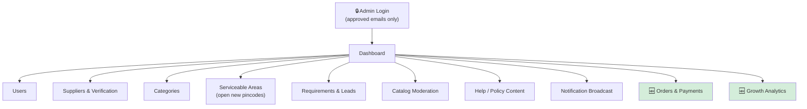
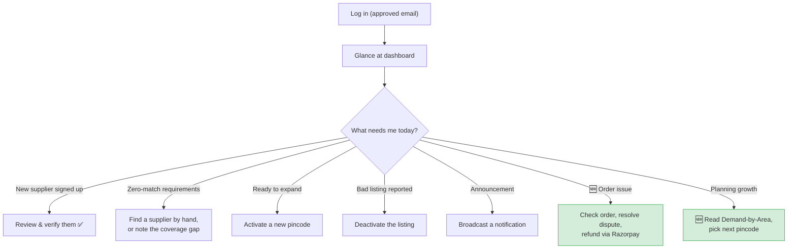

# 04 — The Admin Panel

### Your control room for running the entire marketplace

> **For non-technical readers:** this is the private dashboard that **you and your team** use — never customers. It's how you approve suppliers, switch on new neighbourhoods, see what's selling, and fix problems, all without an engineer and without ever touching the raw database. If the apps are the shopfront, the admin panel is the back office.

---

## 1. What the admin panel is for

You said you wanted to "manage each and everything." This panel turns that into a concrete, bounded set of tools — deliberately scoped so it doesn't quietly become a second giant product to build. Its purpose: **let you operate the marketplace without ever editing the database by hand.**

It's a separate website from the customer-facing one, for good reasons:

- **Different audience:** you and staff, not buyers and suppliers.
- **Different login:** email + password restricted to an approved list — never the public code-login.
- **Different look:** desktop-first, dense tables (you're at a desk, doing operations).
- **Safety:** a bug in the admin panel can never take down the customer apps, because they're separate.

---

## 2. The map of the admin panel

---

## 3. Section by section, in plain language

### 3.1 Dashboard — your morning glance

> **In plain English:** the numbers that actually matter for a young marketplace — not vanity stats. The single most important one is **"Requirements with zero matches."**

| Number shown | Why you watch it |
|---|---|
| Active requirements (open / matched / quoted) | Is the demand engine working? |
| Leads sent vs. viewed vs. quoted (last 7 days) | How responsive are suppliers? (your speed advantage) |
| New users / new suppliers (last 7 days) | Growth |
| **Requirements with zero matches** | **The most important early metric** — each one is a gap (a missing supplier or category in an area) you should personally go fill |

### 3.2 Users

> A searchable table of everyone: name, contact, role, area, signup date, last active. You can view a person, manually flip them to "supplier," or **suspend** an account (which sets a flag the login checks — it doesn't delete their history).

### 3.3 Suppliers & Verification — where trust is created

> **In plain English:** this is where you award the **"Verified" badge** that buyers rely on. In v1, verification is **manual — done by you, by eye.** That's intentional: you don't build an automated document-checking system before you've personally verified your first ~50 suppliers and learned what actually needs checking.

| What you see | What you can do |
|---|---|
| Business name, GST number, phone | Review |
| Uploaded documents | View |
| Verified toggle | **Manually approve** — your judgment, not a robot's |
| Service areas | Edit which pincodes they cover |
| Categories | Edit which materials they list under |

### 3.4 Categories

> Create and arrange the material categories (name, icon, order on the grid). Keep it simple — a flat list or one level of nesting — because elaborate category trees are wasted effort before you have real product volume.

### 3.5 Serviceable Areas — your launch lever

> **In plain English:** this is the literal control for "open Nirmaan in a new neighbourhood." Adding and activating a pincode here makes it instantly live for buyers and suppliers — **no engineer, no app update.** This single screen *is* your geographic growth strategy.

| Action | Effect |
|---|---|
| Add a pincode | Added, switched **off** by default |
| Activate | Buyers can now post requirements there; suppliers can declare service |
| Deactivate | Stops new requirements without deleting any history |
| View map | See your live coverage (useful when deciding where to expand) |

### 3.6 Requirements & Leads — your manual-hustle queue

> **In plain English:** a table of every requirement and its lead/quote counts. **Zero-match requirements are surfaced loudly** — that's your personal to-do list. When the system can't find a supplier for a buyer, you go find one by hand. The panel makes that hustle *visible and trackable* instead of living in your head.

### 3.7 Catalog Moderation

> A list of every product suppliers have listed. You can **deactivate** a bad listing (wrong price, bad photo, spam) yourself, without waiting for the supplier.

### 3.8 Help / Policy Content

> A simple editor for the Help, Privacy Policy, and Terms pages that the apps link to. Updating your privacy policy is an edit here — **not a code release.**

### 3.9 Notification Broadcast

> Write a message, pick who gets it (everyone / all suppliers in area X / all buyers), send. For announcing a new area opening or a policy change without involving engineering.

### 3.10 🆕 Orders & Payments

> **In plain English:** once real orders exist, this is where your team oversees them — see every order and its status, see payments and the commission split, handle fulfilment progress, and manage refunds and disputes by hand. There's no separate payment-control screen to build: for the money itself, you use **Razorpay's own dashboard.**

### 3.11 🆕 Growth Analytics ("Growth Intelligence")

> **In plain English:** the dashboards that tell you where to grow. The centrepiece, **"Demand by Area,"** ranks pincodes by how much demand they're generating — *including pincodes you don't serve yet* — with a shortlist of where to expand next. This is the data-driven version of the zero-match signal: it doesn't just show gaps, it shows where the biggest gaps are.

---

## 4. The complete ADMIN journey

---

## 5. Who can log in, and how access works

> **In plain English:** only people on an approved email list can get in, with email + password (never the public code-login). In v1 there's effectively one role — you. Finer permissions (e.g. a support hire who can view but not edit) come later, once you actually hire someone.

🆕 **v2.1** introduced real admin accounts with **four roles** — enough structure for a small team without the complexity of a fine-grained permission matrix (which was deliberately left out).

---

## 6. What the admin panel deliberately leaves out

- Heavy BI dashboards beyond the metrics above (v1) — though v2.1 added the focused Growth Analytics
- Automatic supplier document verification (you verify by hand on purpose)
- A fine-grained per-action permission matrix (the handful of roles suffice)
- Bulk spreadsheet import/export (add only if manual entry becomes a real bottleneck)
- A parallel payment-control UI (use Razorpay's dashboard for the money)

---

## 7. The technical bits worth knowing (for engineers)

- Built with **Next.js**, desktop-first, data-dense tables.
- Auth is an **email allowlist** (env config in early phases; a real `admin_users` table with roles in v2.1) — never the public OTP flow.
- All data flows through the same backend brain as the apps; the panel has no special database access.

---

## 8. Summary for a co-founder

The admin panel is your **operating cockpit**. From one screen you verify suppliers (creating the trust buyers rely on), switch on new pincodes (your entire geographic growth strategy, no engineer needed), and watch the one metric that matters most early — **requirements that found nobody** — so you can personally close those gaps. In v2.1 it also became your window onto orders, payments, and a real **Demand-by-Area** map showing exactly where to expand next. It's deliberately scoped to be a control room, not a second product.
