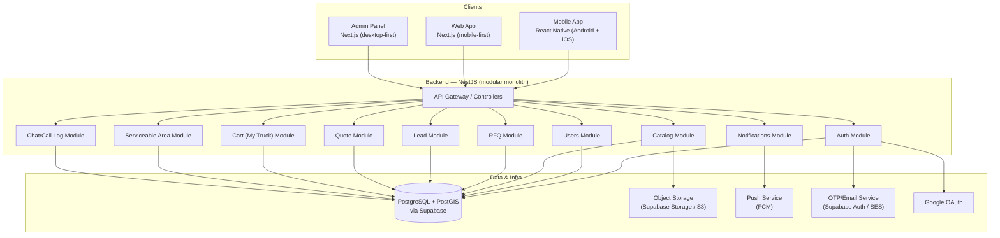
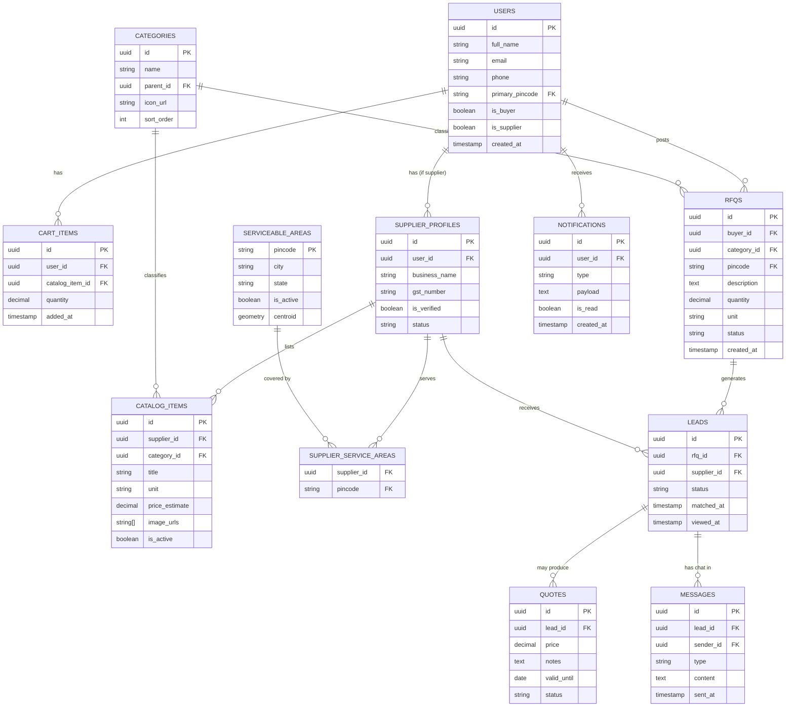

# Nirmaan — Master Technical PRD
**v1.0 · MVP scope · Single-region launch (Dehradun + Haridwar)**

This is the master document. It covers the database decision, system architecture, the shared data model used by every app, and cross-cutting concerns (auth, geofencing, notifications). Each application then has its own focused PRD:

- `PRD-01-Backend-NestJS.md`
- `PRD-02-Mobile-ReactNative.md`
- `PRD-03-Web-NextJS.md`
- `PRD-04-Admin-Panel.md`

Read this document first — the other four assume the schema and decisions made here.

---

## 1. Database Decision: PostgreSQL, not MongoDB

**Verdict: Use PostgreSQL. Do not use MongoDB for this product.** Here's the actual reasoning, specific to what you're building — not a generic "Postgres vs Mongo" take.

### 1.1 Why relational wins for this exact app

Your core workflow is a **chain of relationships with integrity requirements**:

```
User (role: buyer/supplier)
  └─ posts → RFQ (category, pincode, quantity)
                └─ matched against → Supplier Catalog (category × ServiceableArea)
                          └─ generates → Lead (RFQ × Supplier, status)
                                    └─ supplier responds → Quote (price, validity)
                                              └─ buyer accepts → Order intent
  └─ adds items → CartItem ("My Truck")
```

Every arrow above is a **foreign key with a constraint that must hold**: a Lead cannot exist without a valid RFQ and a valid Supplier; a Quote cannot exist without a valid Lead; geofencing match logic needs to join Users ↔ ServiceableAreas ↔ Categories in one query. This is precisely what relational databases are built for, and precisely where MongoDB requires you to either denormalize (and then manually keep copies in sync) or do `$lookup` aggregations that end up looking like SQL joins anyway, minus the guarantees.

**The specific failure mode MongoDB invites here:** a lead gets created but the RFQ status update fails (network blip, crash) — now you have an orphaned lead and a stuck RFQ, and nothing in the database stopped it. In Postgres, that's one transaction; it either fully happens or fully doesn't.

### 1.2 Your two stated concerns: cost and manageability

| Concern | PostgreSQL answer |
|---|---|
| **"Not expensive"** | **Supabase free tier** covers your entire MVP and pilot phase (500MB DB, 50k monthly active users, unlimited API requests). Paid tier is $25/mo only when you outgrow free — likely well past your first ₹1L/month profit gate. |
| **"Hard to manage"** | Supabase gives you a **GUI table editor, built-in auth, auto-generated REST/GraphQL, and one-click backups** — arguably *less* ops burden than self-managing MongoDB Atlas. You will rarely touch a terminal for database admin. |
| **Geofencing (pincode-wise)** | **PostGIS** (a free Postgres extension, enabled by default on Supabase) handles point-in-polygon and radius queries natively. This is mature, widely documented, and exactly the right tool — MongoDB's geo support is functional but has a smaller ecosystem and weaker tooling for this. |
| **Search (categories/catalog)** | Postgres full-text search (`tsvector`) is sufficient for MVP catalog search. You don't need ElasticSearch yet — that was correctly deferred in the earlier roadmap, and Postgres removes the need for a second database engine entirely. |

### 1.3 The one place MongoDB would have been fine

If your core object were a single, deeply nested, rarely-joined document (e.g., a chat transcript, an analytics event log), MongoDB's document model would shine. **Your chat/message log is one such case** — see §4.6 — and you can store that as JSONB *inside* Postgres without needing a second database at all. You get the flexibility without the operational cost of running two database systems.

### 1.4 Final recommendation

> **Use Supabase (managed PostgreSQL + PostGIS + Auth + Storage).** Connect to it from NestJS via **Prisma** (recommended) or TypeORM. This is the lowest-cost, lowest-ops-burden, most correct choice for your data shape.

---

## 2. System Architecture Overview



**Why a modular monolith and not microservices:** at MVP scale (one region, low thousands of users), microservices add deployment and debugging overhead with no real benefit. NestJS's module system gives you clean internal boundaries (each module above maps to a NestJS module with its own controller/service/repository) so you *can* split into services later without a rewrite — but you don't pay that cost now.

---

## 3. Shared Concepts Across All Apps

### 3.1 Roles
A single `User` can hold either or both roles. This matters because the same person might browse as a buyer today and register their shop as a supplier next month — don't force a hard fork at signup.

| Role | Capabilities in v1 |
|---|---|
| **Buyer** | Browse categories, post RFQ, view quotes, manage My Truck, chat/call suppliers |
| **Supplier** | Receive leads, view RFQs in their service area + category, submit quotes, manage catalog listing |
| **Admin** | Manage everything (see PRD-04) |

### 3.2 Geofencing model (pincode-wise)
- A **ServiceableArea** is the atomic unit: one row per active pincode.
- At launch, only pincodes for Dehradun + Haridwar are seeded as `is_active = true`.
- A user's "current area" is stored on their profile (`primary_pincode`) and can be switched manually (location-picker, like Swiggy/Zomato's "deliver to" pattern) — **do not** silently auto-detect and lock; let the user confirm.
- Suppliers declare which pincodes they serve (many-to-many: `supplier_service_areas`).
- RFQ matching always filters by: `rfq.pincode ∈ supplier.service_areas AND rfq.category ∈ supplier.categories`.
- PostGIS is used for the *future* radius-based version (e.g., "serve within 5km"), but v1 ships with simple pincode-equality matching — radius logic is a v1.1 upgrade, not a blocker.

### 3.3 Multi-language support (English + Hindi, v1)

Two different things get called "language support," and they have very different costs — keep them separate:

| Type | Examples | v1 approach |
|---|---|---|
| **UI strings** (static, written by you) | Button labels, tab names, error messages, "My Truck", "Post Requirement" | Translation files (`en.json`, `hi.json`) shipped with each client. No backend involvement, near-zero cost. |
| **Structured content** (low row count, high visibility) | Category names, Help/Privacy/Terms pages | Stored per-locale in the DB (`category_translations`, `content_pages.locale`) — see schema §4.4, §4.8. Cheap because row counts are small and you control the source text. |
| **Free-text user content** (out of scope for v1) | RFQ descriptions, chat messages, catalog item titles a supplier typed | **Not translated in v1.** Displayed as-typed. Real-time translation of arbitrary user text is a v2+ feature (needs a translation API, cost-per-call, and quality review) — building it now would delay the MVP for a feature most early users in one region won't need, since most participants in Dehradun/Haridwar will share a working language anyway. |

**User locale preference:** `users.preferred_locale` (`en` | `hi`) drives which translation file the client loads and which `category_translations` / `content_pages` row the backend returns. Default `en`; the onboarding screen (PRD-02 §3.2) should offer a one-tap language toggle alongside name + area, since this is the cheapest moment to ask.

**Fallback rule (enforced in the backend, not duplicated per client):** if a `hi` translation row is missing for a category, return the default `name` (English) rather than an empty string. Never let a missing translation break a screen.

### 3.4 Naming consistency
Use these exact terms everywhere (API field names, UI labels, DB tables) to avoid the classic bug of "cart" in code and "My Truck" in UI causing confusion:

| User-facing label | Internal/DB name |
|---|---|
| My Truck | `cart` / `cart_items` |
| Post Requirement | `rfq` (Request for Quote) |
| Categories | `categories` |
| Area / Pincode | `serviceable_area` |

---

## 4. Shared Database Schema (PostgreSQL)

This is the single source of truth schema. All four apps read/write against this via the NestJS backend — no app talks to the database directly except the backend.



### 4.1 `users`
Single table for both buyer and supplier identity (role flags, not separate tables) — this avoids painful migrations later if a user becomes both.

| Column | Type | Notes |
|---|---|---|
| id | uuid, PK | |
| full_name | text | |
| email | text, unique, nullable | nullable because phone-only signup may be supported later |
| phone | text, unique, nullable | |
| primary_pincode | text, FK → serviceable_areas | the user's selected area |
| is_buyer | boolean, default true | |
| is_supplier | boolean, default false | |
| auth_provider | enum(`email_otp`, `google`) | |
| created_at, updated_at | timestamp | |

### 4.2 `serviceable_areas`
The geofencing table. **Seed this manually at launch** — do not auto-expand. Adding a pincode is an admin action (see PRD-04).

| Column | Type | Notes |
|---|---|---|
| pincode | text, PK | e.g., `248001` |
| city, state | text | |
| is_active | boolean | controls whether RFQs can be posted from here |
| centroid | geometry(Point) | PostGIS point, for future radius matching |

### 4.3 `supplier_profiles`, `supplier_service_areas`
A supplier is a `user` with `is_supplier = true` plus a profile row holding business details and a join table for which pincodes they cover.

### 4.4 `categories`
Self-referencing for parent/child (e.g., "Tiles" → "Bathroom Tiles"). Flat for v1 is fine — don't over-build the taxonomy before you have real catalog data.

### 4.5 `rfqs`, `leads`, `quotes`
This is the demand engine described in your MVP table.

- **RFQ status enum:** `open → matched → quoted → closed → expired`
- **Lead status enum:** `pending → viewed → quoted → declined → expired`
- **Quote status enum:** `sent → accepted → rejected → expired`

### 4.6 `cart_items` ("My Truck")
Simple — a user's saved catalog items before converting to an RFQ or direct supplier contact. The "truck vs pickup vs bailgadi" sizing logic (your tiered cart icon idea) is a **frontend presentation rule**, not a backend concern: the backend just returns `item_count` and `total_estimated_value`; each client decides whether to render a bicycle/pickup/truck icon based on thresholds (see PRD-02 §3.3).

### 4.7 `messages`
Chat log per lead, stored as rows in Postgres (not a separate Mongo collection) — at MVP volume this is trivial for Postgres, and keeping one database simplifies backups, joins ("show me all messages for leads belonging to this supplier"), and admin moderation.

### 4.8 `notifications`
Generic notification feed (push + in-app); `payload` is `jsonb` so you can evolve notification types without schema migrations for every new kind.

---

## 5. Cross-Cutting Decisions

| Decision | Choice | Why |
|---|---|---|
| ORM | **Prisma** | Type-safe, great DX with NestJS, easy migrations |
| Auth strategy | OTP (email) via Supabase Auth or custom + SES; Google OAuth via Supabase Auth | Matches your stated requirement exactly; avoids building OTP infra from scratch |
| API style | REST (NestJS controllers), versioned `/api/v1/` | GraphQL is unnecessary complexity for MVP |
| File storage | Supabase Storage (catalog images, supplier docs) | Same vendor as DB, one bill, simple |
| Push notifications | Firebase Cloud Messaging (FCM) | Free, works for both Android and iOS, React Native has mature support |
| Hosting (backend) | Railway or Render to start; AWS later | Cheaper and far less ops than raw AWS at MVP stage |
| Environments | `dev`, `staging`, `prod` — three separate Supabase projects | Free tier covers dev + staging; prod on paid tier once revenue starts |

---

## 6. What's Explicitly Out of Scope for v1

Stated here once so it isn't re-litigated in each app PRD:

- Payments/escrow, in-app checkout
- Credit referral / NBFC integration
- Supplier subscription billing
- iOS-specific features beyond parity with Android
- Multi-language UI (ship in English + basic Hindi labels only if trivial; don't build an i18n framework yet)
- Ratings/reviews system
- Radius-based (non-pincode) geofencing

---

## 7. Document Index

| File | Covers |
|---|---|
| `PRD-01-Backend-NestJS.md` | Module breakdown, API contracts, auth flow detail |
| `PRD-02-Mobile-ReactNative.md` | Screens, navigation, the 4-tab structure, cart-icon logic |
| `PRD-03-Web-NextJS.md` | Mobile-first web, 4-header-nav layout, SSR/SEO considerations |
| `PRD-04-Admin-Panel.md` | What "manage everything" means concretely, area/category/user management |
