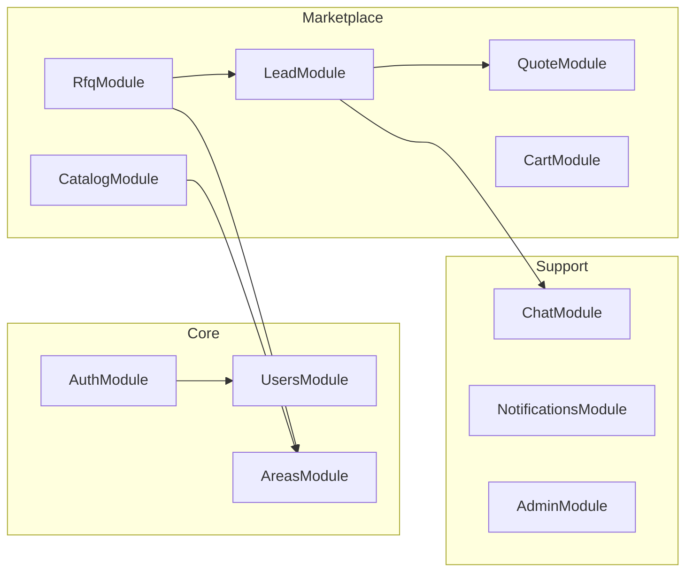
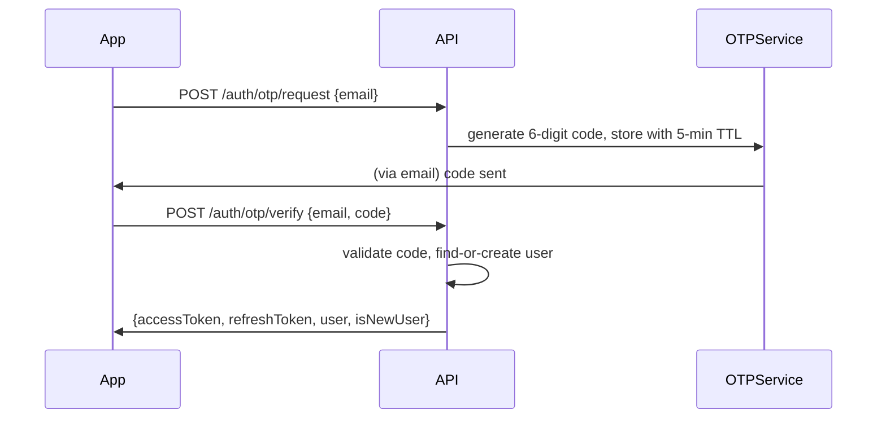
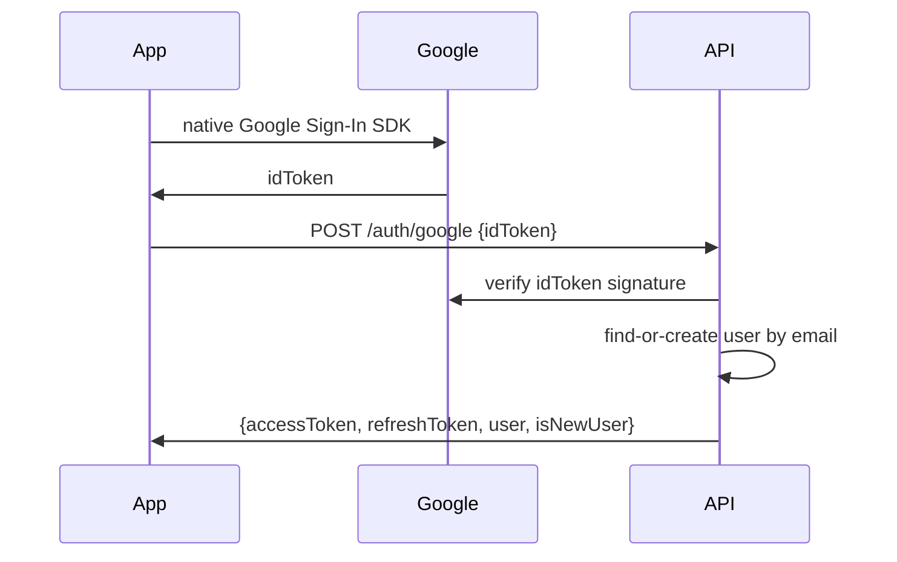
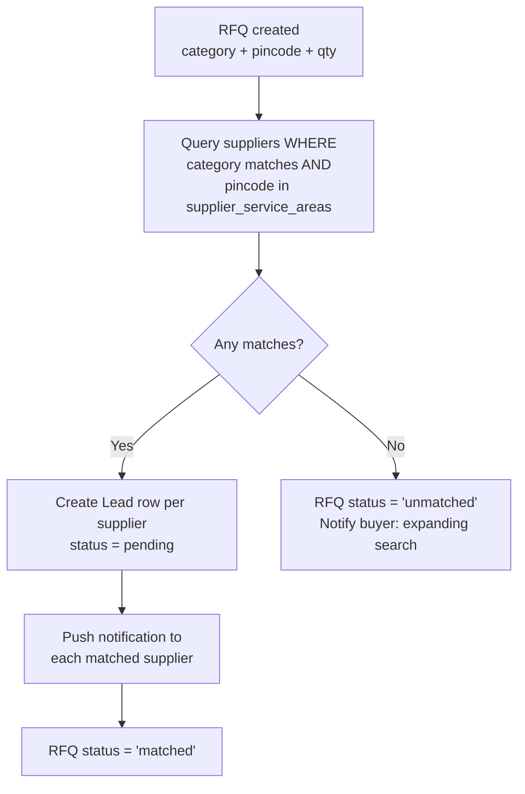

# PRD-01 — Backend (NestJS)
**Depends on:** `PRD-00-Master-Architecture.md` (schema, DB decision, shared concepts)

## 1. Purpose
Single backend serving the Mobile app, Web app, and Admin panel through one versioned REST API. No client talks to Postgres directly.

## 2. Module Breakdown



Each module = its own folder with `controller`, `service`, `dto`, `repository` (Prisma calls live in the service layer, never directly in controllers).

## 3. Auth Module

### 3.1 Flows to support

**Email OTP signup/login**


**Google login**


### 3.2 API contract

| Endpoint | Method | Body | Response | Notes |
|---|---|---|---|---|
| `/api/v1/auth/otp/request` | POST | `{email}` | `{success, expiresInSec}` | rate-limit: 3/hour per email |
| `/api/v1/auth/otp/verify` | POST | `{email, code}` | `{accessToken, refreshToken, user, isNewUser}` | `isNewUser` tells client to show onboarding (name + pincode) |
| `/api/v1/auth/google` | POST | `{idToken}` | same shape as above | |
| `/api/v1/auth/refresh` | POST | `{refreshToken}` | `{accessToken}` | |
| `/api/v1/auth/logout` | POST | `{}` (auth header) | `{success}` | invalidates refresh token |

**Token strategy:** JWT access token (15 min expiry) + refresh token (30 days, stored hashed in DB so it can be revoked). Standard, nothing exotic needed here.

### 3.3 New-user onboarding requirement
After first successful OTP/Google verification, if `isNewUser`, the client must collect: `full_name`, `primary_pincode` before allowing access to Home. This is enforced server-side too — endpoints other than `/users/me` return `403 PROFILE_INCOMPLETE` until both fields are set.

## 4. Users Module

| Endpoint | Method | Notes |
|---|---|---|
| `/api/v1/users/me` | GET | Returns profile + role flags |
| `/api/v1/users/me` | PATCH | Update name, pincode, become-supplier toggle |
| `/api/v1/users/me/area` | PATCH | `{pincode}` — dedicated endpoint since changing area is a frequent, important action (header "switch area" control) |

## 5. Areas Module (Geofencing)

| Endpoint | Method | Notes |
|---|---|---|
| `/api/v1/areas/check?pincode=` | GET | `{servicable: boolean, city, state}` — used by the area picker before letting a user select it |
| `/api/v1/areas/active` | GET | List of all active pincodes (for area-picker dropdown/search) |

Admin-only endpoints to add/deactivate areas live in the Admin module (PRD-04).

## 6. Catalog Module

| Endpoint | Method | Notes |
|---|---|---|
| `/api/v1/categories?locale=` | GET | Flat list, ordered by `sort_order`, includes icon URLs for the home/category grid |
| `/api/v1/categories/:id/suggestions?q=&locale=` | GET | Powers the search-bar autosuggest (4 results) — see §6.1 |
| `/api/v1/catalog?category=&pincode=&q=` | GET | Paginated supplier catalog search, filtered by serviceable area |
| `/api/v1/catalog/:id` | GET | Single item detail |
| `/api/v1/supplier/catalog` | POST/PATCH/DELETE | Supplier manages own listings (auth: `is_supplier`) |

### 6.0 Locale handling (applies to every endpoint below)
`locale` defaults to the authenticated user's `preferred_locale` if the query param is omitted — clients don't need to pass it on every call once the user is logged in, only when overriding (e.g., the onboarding language toggle, before a session exists).

A single shared helper (`resolveTranslation(entity, locale)`) is used everywhere a translated field is read, implementing the fallback rule from PRD-00 §3.3: look up the `category_translations` row for `(categoryId, locale)`; if absent, return `category.name`. **Write this once in the Catalog service, do not reimplement the fallback logic per endpoint** — that's how locale bugs creep in.

### 6.1 Search-bar autosuggest contract
This directly implements your "search bar opens with ~4 suggestions" requirement. Labels respect `locale` via the same fallback helper.

```
GET /api/v1/search/suggest?q=til&pincode=248001&locale=hi
→ {
    "suggestions": [
      {"type": "category", "id": "...", "label": "टाइलें", "icon": "..."},
      {"type": "category", "id": "...", "label": "टाइल चिपकाने वाला पदार्थ", "icon": "..."},
      {"type": "item", "id": "...", "label": "Vitrified Tiles - 2x2 ft", "supplierCount": 6},
      {"type": "item", "id": "...", "label": "Tile Grout - White", "supplierCount": 3}
    ]
  }
```
Note item labels stay in whatever language the supplier typed them in (per PRD-00 §3.3, free-text isn't translated in v1) — only category labels are localized. Limit hardcoded to 4 server-side (configurable via env var, not a magic number buried in frontend code) — when the user taps a suggestion or submits, they land on the Category page filtered/pre-searched.


## 7. RFQ Module ("Post Requirement")

| Endpoint | Method | Notes |
|---|---|---|
| `/api/v1/rfqs` | POST | Creates RFQ; **triggers matching job** (see §7.1) |
| `/api/v1/rfqs` | GET | Buyer's own RFQs (filter by status) |
| `/api/v1/rfqs/:id` | GET | Detail + associated leads/quotes |
| `/api/v1/rfqs/:id` | PATCH | Edit/cancel while still `open` |

### 7.1 Matching logic (triggered on RFQ creation)

This runs synchronously for MVP (supplier counts per pincode are small); move to a queue (BullMQ + Redis) only once matching volume justifies it — don't build queue infra before you need it.

## 8. Lead Module

| Endpoint | Method | Notes |
|---|---|---|
| `/api/v1/leads?status=` | GET | Supplier's incoming leads |
| `/api/v1/leads/:id` | GET | Detail (includes RFQ info + buyer contact once quoted) |
| `/api/v1/leads/:id/view` | PATCH | Marks `viewed_at`, status → `viewed` |
| `/api/v1/leads/:id/decline` | PATCH | status → `declined` |

## 9. Quote Module

| Endpoint | Method | Notes |
|---|---|---|
| `/api/v1/leads/:id/quotes` | POST | Supplier submits quote → lead status `quoted`, push to buyer |
| `/api/v1/quotes/:id/accept` | PATCH | Buyer accepts → triggers chat/call unlock |
| `/api/v1/quotes/:id/reject` | PATCH | |

## 10. Cart ("My Truck") Module

| Endpoint | Method | Notes |
|---|---|---|
| `/api/v1/cart` | GET | Returns items + `total_item_count` + `total_estimated_value` |
| `/api/v1/cart` | POST | Add item `{catalogItemId, quantity}` |
| `/api/v1/cart/:itemId` | PATCH/DELETE | Update qty / remove |

Tiered icon logic (bicycle → pickup → truck) is computed client-side from `total_item_count`; backend just returns the count, keeping presentation logic out of the API (see PRD-00 §4.6).

## 11. Chat Module
Simple per-lead message thread. Real-time via WebSocket (NestJS `@WebSocketGateway`) for in-app delivery; push notification (FCM) when recipient is offline.

| Endpoint | Method | Notes |
|---|---|---|
| `/api/v1/leads/:id/messages` | GET | Paginated history |
| `/api/v1/leads/:id/messages` | POST | Send message (text; `type: call_request` for "request a call back") |
| WS `leads/:id` | — | Real-time message delivery while both parties online |

> **v1 scope on "call":** a tap-to-call that opens the native dialer with the supplier's number (once a quote is accepted) is sufficient — building in-app VoIP is unnecessary complexity for MVP.

## 12. Notifications Module
Thin wrapper: any module can call `notificationsService.send(userId, type, payload)`, which writes a `notifications` row and fires FCM in parallel.

## 13. Non-functional requirements

| Concern | Requirement |
|---|---|
| Auth | All endpoints except `/auth/*` and `/areas/check` require valid JWT |
| Rate limiting | OTP request endpoint, search suggest endpoint |
| Validation | `class-validator` DTOs on every endpoint — reject bad input at the edge |
| Logging | Structured logs (pino), request ID propagation |
| Error shape | Consistent `{statusCode, error, message}` across all endpoints |
| Environments | `.env` per environment; never commit secrets |
