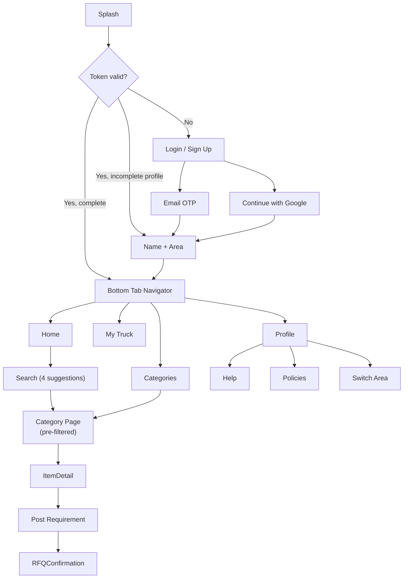
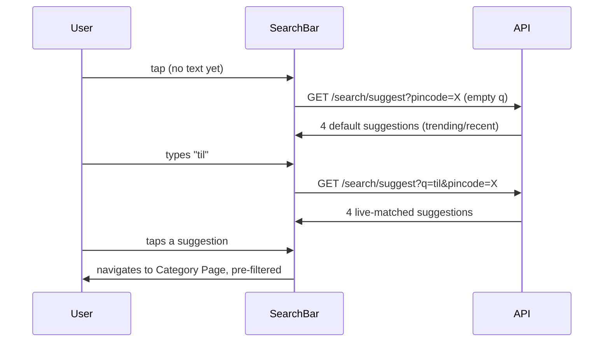

# PRD-02 — Mobile App (React Native, Android + iOS)
**Depends on:** `PRD-00-Master-Architecture.md`, `PRD-01-Backend-NestJS.md`

## 1. Purpose
The primary product surface. Android ships first (your user base is Android-heavy per earlier research); iOS is built in parallel where RN allows but QA'd second.

## 2. Navigation Structure



## 3. Screen-by-Screen Spec

### 3.1 Auth: Login / Sign Up
- Single screen, no separate "login" vs "signup" — OTP/Google flows naturally branch into either based on `isNewUser`. **Do not** make the user choose "I'm new" vs "I have an account"; that's friction this product doesn't need.
- Fields: email input → "Send Code" button. Below: divider "or" → "Continue with Google" button.
- On OTP send: 6-box OTP input, auto-read from SMS/email where platform allows, 30s resend timer.

| Element | Behavior |
|---|---|
| Email field | Validates format client-side before enabling "Send Code" |
| OTP input | Auto-focus next box on digit entry; auto-submit on 6th digit |
| Google button | Native Google Sign-In SDK (`@react-native-google-signin/google-signin`) |
| Error states | Wrong code → inline red text under boxes, not a modal/toast (keeps user in flow) |

### 3.2 Onboarding (new users only)
Two fields on one screen: **Name**, **Area (pincode)**. Area field uses the same picker component as the header's area-switch (§3.3) — built once, reused everywhere.

### 3.3 Header (persistent across Home/Categories/Truck/Profile)

```
┌─────────────────────────────────────────┐
│  [Logo] Nirmaan        📍 Dehradun  ▾  👤 Rohit │
└─────────────────────────────────────────┘
```

| Element | Behavior |
|---|---|
| Logo + name | Static, tap → no-op or splash-style about screen |
| Area pill (📍 city ▾) | Tap opens area picker (search + list of active pincodes); changing it re-filters Home/Categories results immediately |
| Username | Tap → jumps to Profile tab |

### 3.4 Home Tab
- **Search bar** at top (your spec: tapping opens with 4 suggestions before any typing — i.e., recent searches or trending categories as defaults, then live results as the user types).
- Below: category quick-grid (icons), then "Popular near you" catalog items (filtered by current area).

**Search interaction detail:**


### 3.5 Categories Tab
- Per your spec: this screen **is** a search bar — full-width search input at top, with the same suggestion behavior as Home, plus a scrollable grid/list of all categories below it for browsing without typing.
- Tapping a category card → Category Page (same destination as a search result, just unfiltered by query).

### 3.6 Category Page
- Filtered catalog list (supplier items in this category + current area).
- Each card: item title, unit, price estimate, supplier name, "Add to Truck" + "Post Requirement instead" actions.
- Top of page: a persistent "Can't find it? Post a Requirement" banner — this is the RFQ entry point, your core demand engine, so it must never be buried.

### 3.7 Post Requirement (RFQ) flow
Short form, 4 fields max: Category (pre-filled if entered from a category page), Description, Quantity + Unit, confirm Area (pre-filled from header). Submit → confirmation screen: "We've notified suppliers near you" with expected response context — **set honest expectations**, don't imply instant fulfillment.

### 3.8 My Truck Tab (Cart)
Your tiered-icon idea, implemented as a pure presentation rule driven by `total_item_count` from the cart API:

| Item count | Icon shown | Label |
|---|---|---|
| 0 | empty cycle-cart outline | "My Truck is empty" |
| 1–5 | 🛺 hand-cart / "Bailgadi" | "My Truck" |
| 6–15 | 🛻 pickup | "My Truck" |
| 16+ | 🚛 truck (default/full) | "My Truck" |

The **tab label always reads "My Truck"** per your instruction (truck is the default identity of the feature); only the *icon* changes with size — this avoids confusing copy changes on a primary nav tab while still giving the playful size feedback you described.

- List of items with quantity steppers, line subtotal (estimate, not final price — these are construction materials with negotiated pricing, so "estimated value" language, never "total price," avoids implying a fixed checkout).
- CTA: "Send as Requirement" — converts cart contents into one or more RFQs (grouped by category) rather than a traditional checkout, since this product doesn't process payment in v1.

### 3.9 Profile Tab
- Header: name, phone/email, edit icon.
- Sections: "Become a Supplier" (if `is_supplier = false`), My Requirements (RFQ history), My Truck history, **Help & Support**, **Privacy Policy**, **Terms of Service**, Switch Area, Logout.

## 4. Cross-cutting Mobile Concerns

| Concern | Decision |
|---|---|
| State management | React Query (server state) + lightweight Zustand (UI/local state) — matches stack already used elsewhere in your work |
| Navigation | React Navigation, bottom tabs + stack per tab |
| Push notifications | FCM via `@react-native-firebase/messaging`; deep-link a lead notification straight to that Lead's detail screen |
| Offline/loading | Skeleton loaders, not spinners, for catalog/category lists — feels faster, matches "super smooth" requirement |
| Design system | One shared component library (buttons, inputs, cards) used identically across Home/Categories/Truck/Profile — non-negotiable for the "smooth UX" goal; inconsistency between tabs is the most common way MVP apps feel cheap |

## 5. Out of scope for v1 (mobile)
- iOS-exclusive features or design deviations
- Biometric login
- In-app payments
- Push-notification rich actions (quick-reply from notification tray) — open the app instead
