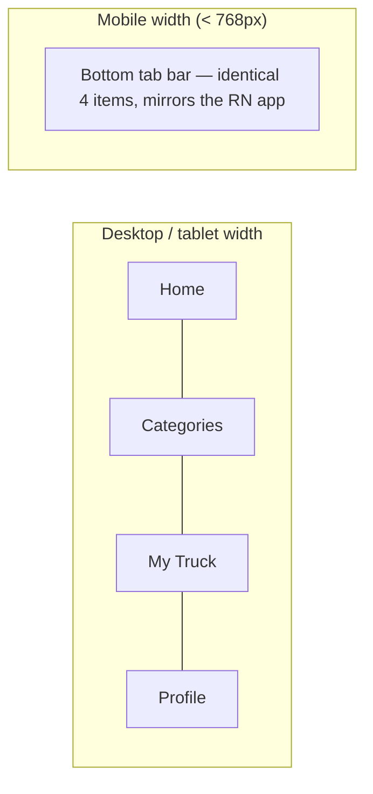

# PRD-03 — Web App (Next.js, mobile-first)
**Depends on:** `PRD-00-Master-Architecture.md`, `PRD-01-Backend-NestJS.md`

## 1. Purpose
Same product as the mobile app, same backend, but mobile-first responsive web — this is your SEO and no-install entry point (recall from the earlier roadmap: hyperlocal search intent like "tile wholesalers Dehradun" is a cheap, compounding acquisition channel that only a web presence captures).

## 2. Why mobile-first specifically
Most of your actual traffic (contractors searching on a phone browser before they'd bother installing an app) will be on mobile viewports even on the **web** product. Next.js pages should be designed at 375px width first, then progressively enhanced for desktop — not the reverse.

## 3. Navigation: 4 header items (desktop) / same 4 as bottom tabs (mobile web)



This means you maintain **one navigation config** (route, label, icon) consumed two ways: rendered as a top horizontal nav above `md` breakpoint, and as a fixed bottom tab bar below it. Don't hand-build two separate nav components with duplicated logic.

## 4. Page-by-Page Spec

### 4.1 Routing structure
```
/                       → Home
/categories             → Categories (search-first)
/categories/[slug]      → Category Page (filtered catalog)
/truck                  → My Truck
/profile                → Profile (auth-gated)
/login                  → Auth (OTP / Google)
/rfq/new                → Post Requirement
/rfq/[id]               → RFQ detail (status, leads, quotes)
/help, /privacy, /terms → Static/CMS-driven pages
```

### 4.2 Home
Identical structure to mobile: header (logo, area pill, username/login), search bar with 4-suggestion autosuggest, category quick-grid, "Popular near you" list. **SSR this page** (`getServerSideProps` or App Router server component) so search engines index real category/area content — this is your SEO surface, unlike the mobile app.

### 4.3 Categories
Search-bar-first layout exactly as specified for mobile (§3.5 of PRD-02) — full-width search at top, category grid below. Each category card links to a **real, crawlable URL** (`/categories/tiles-dehradun` style slugs incorporating area where useful) so Google can index "tiles dehradun" type queries directly.

### 4.4 Category Page
Same content contract as mobile (filtered catalog + "Post a Requirement" banner). On web, additionally render basic structured data (`schema.org/Product` or `LocalBusiness` where applicable) — small effort, real SEO payoff, and directly serves the hyperlocal-SEO strategy from the broader roadmap.

### 4.5 My Truck
Same cart logic and tiered icon rule as mobile (PRD-02 §3.8), sharing the same backend cart endpoints — a user adding items on web and continuing on mobile should see the same truck, since both hit the same `/api/v1/cart`.

### 4.6 Profile
Auth-gated route; redirects to `/login?redirect=/profile` if no valid session. Same content sections as mobile (Help, Privacy, Terms, Switch Area, Become a Supplier, Logout).

### 4.7 Auth pages
Same OTP + Google flow as mobile, adapted to web form patterns (no native OTP auto-read, so a manual "paste code" affordance matters more here).

## 5. Rendering Strategy

| Page | Strategy | Why |
|---|---|---|
| Home, Categories, Category Page | SSR / Server Components | SEO-critical, content changes per area |
| My Truck, Profile, RFQ pages | Client-rendered (CSR) behind auth | Personalized, no SEO value, faster to ship |
| Help/Privacy/Terms | Static (SSG) | Rarely changes |

## 6. Shared component reuse
Where feasible, share design tokens (colors, spacing, type scale) and even some logic (API client, validation schemas) between the Next.js web app and the React Native app via a shared package (e.g., a `packages/shared` workspace if you set this up as a monorepo). You don't need a monorepo for v1 if it adds setup overhead you don't have time for — but keep the *visual* language identical by hand if the tooling isn't there yet, since brand consistency across web and app is part of the "feel trustworthy" requirement from the broader business plan.

## 7. Out of scope for v1 (web)
- Full desktop-optimized redesign (mobile-first layout simply stretches/reflows for desktop in v1; a true desktop-specific layout is a v2 nicety)
- PWA/installable web app
- Server-side payment processing
