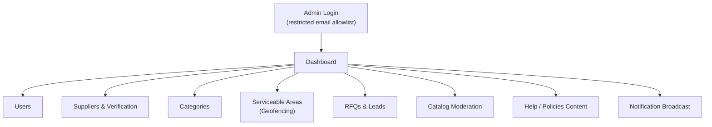

# PRD-04 — Admin Panel (Next.js, desktop-first)
**Depends on:** `PRD-00-Master-Architecture.md`, `PRD-01-Backend-NestJS.md`

## 1. Purpose
You said "manage each and everything" — this PRD turns that into a concrete, scoped feature list so it doesn't quietly become a second full product to build. The admin panel exists to let **you** (and later, a hire) operate the marketplace without touching the database directly.

## 2. Why this is a separate app, not a section of the main web app
Different audience (you/staff, not buyers/suppliers), different auth (no OTP — email+password or magic link restricted to whitelisted admin emails), different layout (desktop-first, data-dense tables), and different deploy cadence. Keeping it separate also means a bug in the admin panel can never take down the buyer/supplier-facing product.

## 3. Information Architecture

## 4. Module-by-Module Spec

### 4.1 Dashboard (home screen)
At-a-glance numbers that matter for a marketplace at this stage — not vanity metrics:

| Metric | Why it matters |
|---|---|
| Active RFQs (open/matched/quoted) | Is the demand engine working? |
| Leads sent vs. viewed vs. quoted (last 7 days) | Supplier responsiveness — your speed advantage from the roadmap |
| New users / new suppliers (last 7 days) | Growth |
| RFQs with zero matches | **Most important early metric** — signals a coverage gap (missing supplier or category in an area) that you need to fix by hand |

### 4.2 Users
- Searchable/filterable table: name, email/phone, role flags, area, signup date, last active.
- Actions: view detail, manually toggle `is_supplier`, suspend account (sets a flag the backend checks on auth, doesn't hard-delete).

### 4.3 Suppliers & Verification
This is where your "Verified supplier" badge (mentioned across the mobile/web PRDs) gets operated.

| Field | Action |
|---|---|
| Business name, GST number, phone | Review |
| Documents (uploaded via supplier app flow, future) | View |
| `is_verified` toggle | Manually approve — **v1 verification is manual, by you**, not an automated KYC pipeline. Don't build automated verification before you've manually verified your first 50 suppliers and know what actually needs checking. |
| Service areas | View/edit which pincodes this supplier covers |
| Categories | View/edit which categories this supplier lists under |

### 4.4 Categories
- CRUD for the category tree: name, icon upload, parent category, sort order (controls grid ordering on Home/Categories).
- This directly controls what buyers see on the category grid — keep it simple (flat or one level of nesting) since over-building taxonomy before you have real catalog volume is wasted effort.

### 4.5 Serviceable Areas (Geofencing)
The control surface for your pincode-wise launch strategy.

| Action | Effect |
|---|---|
| Add pincode | Inserts into `serviceable_areas`, `is_active = false` by default |
| Activate pincode | Buyers can now post RFQs and select this area; suppliers can declare service here |
| Deactivate pincode | Stops new RFQs from this area without deleting historical data |
| View map (PostGIS-backed) | Visualize active areas — useful once you're deciding which pincode to open next |

This is the literal implementation of "start from a particular location" — you control your launch radius entirely from this screen, no code deploy needed to open a new pincode.

### 4.6 RFQs & Leads
- Table of all RFQs with status, category, area, buyer, lead count, quote count.
- **Zero-match RFQs surfaced prominently** (cross-referenced with Dashboard metric in §4.1) — this is your manual-intervention queue: when the system can't match a buyer to a supplier, you personally go find one, exactly as the earlier roadmap's Phase 2 (manual field GTM) prescribed. The admin panel is what makes that manual hustle *visible and trackable* instead of living in your head.

### 4.7 Catalog Moderation
- Flat list of all supplier-listed catalog items, filterable by category/supplier/status.
- Action: deactivate a listing (bad photo, wrong price, spam) without needing the supplier to do it themselves.

### 4.8 Help / Policies Content
- Simple rich-text/markdown editor for the **Help & Support**, **Privacy Policy**, and **Terms of Service** pages that the mobile/web Profile tab links to.
- Stored as content rows (`type`, `body_markdown`, `updated_at`), fetched by the main apps at `/api/v1/content/:type` — so updating your privacy policy is an admin-panel edit, not a code deploy.

### 4.9 Notification Broadcast
- Minimal tool: write a message, pick a target segment (all users / all suppliers in area X / all buyers), send. Useful for announcing a new area opening or a policy update without engineering involvement.

## 5. Auth & Access Control
- Admin login restricted to an **email allowlist** stored in env config or a dedicated `admin_users` table — never reuse the public OTP flow for admin access.
- Single role for v1 (you). Role-based permissions (e.g., a support hire who can only view, not edit) are a v1.1 concern, added once you actually hire someone (Phase 4 of the broader roadmap, gated on profit).

## 6. Out of scope for v1 (admin)
- Analytics/BI dashboards beyond the metrics in §4.1
- Automated supplier KYC/document verification
- Role-based permission tiers
- Bulk CSV import/export tools (add only if manual data entry actually becomes a bottleneck)
