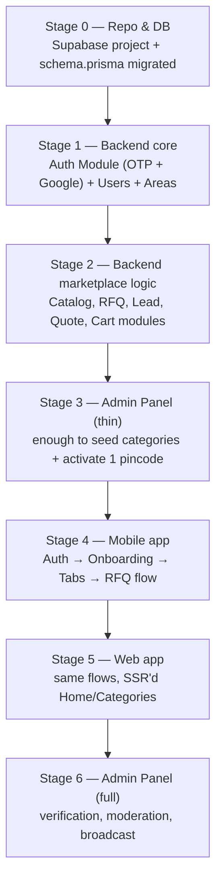

# PRD-05 — Build Sequence & Cowork Setup Notes
**Depends on:** all prior PRDs + `schema.prisma`

This document exists for one reason: four apps built in parallel, with no single source of truth running first, is how MVPs turn into integration nightmares. Build in this order. Each stage should be *working and runnable* before the next starts — don't let agents jump ahead because a later stage "looks easy."

## 1. Build order



**Why this order, specifically:**
- The backend must exist and run before any client is useful — building RN screens against a mocked API wastes the integration work twice.
- A **thin** admin panel comes *before* the mobile app, not after, because without it you have no way to seed a category or activate a pincode — the mobile app would have literally nothing to show. Build just enough admin (categories CRUD + area activation) to unblock testing, then come back for the full admin panel (verification, moderation, broadcast) at the end.
- Mobile before web, matching the earlier roadmap's Android-first decision — your real users are there first.

## 2. Repository structure

Recommended as a single monorepo so Cowork's agents share context across apps without you re-explaining the schema in four places:

```
nirmaan/
├── apps/
│   ├── backend/          (NestJS)
│   ├── mobile/            (React Native)
│   ├── web/                (Next.js)
│   └── admin/             (Next.js)
├── packages/
│   └── shared/            (optional: shared types, API client, validation schemas)
├── schema.prisma          (lives in backend/prisma/, this is the canonical copy)
└── README.md
```

If monorepo tooling (Turborepo/Nx) feels like overhead right now, four separate repos is fine too — just keep `schema.prisma` and the PRD docs as the shared reference all four point back to, and don't let any client define its own duplicate types for the same entities.

## 3. Stage 0 — environment setup checklist

- [ ] Create Supabase project (free tier)
- [ ] Enable PostGIS extension (Database → Extensions)
- [ ] Copy `DATABASE_URL` into `apps/backend/.env`
- [ ] `npx prisma migrate dev --name init` using the provided `schema.prisma`
- [ ] `npx prisma generate`
- [ ] Manually insert 2–3 rows into `serviceable_areas` for Dehradun/Haridwar pincodes, `is_active = true` — do this directly in Supabase's table editor before any admin UI exists, so Stage 1 has data to work against
- [ ] Set up Firebase project for FCM (push notifications) — needed by Stage 2 (lead alerts) and Stage 4 (mobile)
- [ ] Set up Google OAuth client credentials (for Google login) — needed by Stage 1

## 4. What "done" means at each stage (acceptance checks)

| Stage | Done when |
|---|---|
| 0 | `npx prisma studio` shows all 14 tables; 2+ active pincodes exist |
| 1 | Can request an OTP, verify it, get a JWT; can log in with Google; `/users/me` returns profile |
| 2 | Can create a category (via direct DB insert if admin isn't ready yet), post an RFQ, see a Lead auto-created, submit a Quote |
| 3 | You can activate a pincode and add a category from a UI, without touching the DB directly |
| 4 | A real phone can sign up, see Home, post a requirement, and see it reach a lead in the backend |
| 5 | Same flows work in a mobile browser at nirmaan's web URL |
| 6 | You can verify a supplier and moderate a catalog listing from the admin UI |

## 5. Guardrails when briefing Cowork

When handing these PRDs to Cowork (or any agent) to scaffold code, state explicitly:

1. **"Use `schema.prisma` as provided, don't regenerate it from the PRD text."** The PRD prose and ERD are explanations of the schema, not a second spec to re-derive from — re-deriving risks subtle drift (different enum names, missing indexes).
2. **"Build Stage N fully before starting Stage N+1."** Without this instruction, agents tend to scaffold all four app folders at once because it looks like "more progress."
3. **"Anything listed as 'out of scope for v1' in a PRD should not be built unless I ask."** Each PRD has this section for a reason — it's the discipline that keeps the MVP an MVP.
4. **"Flag, don't silently resolve, any conflict between PRDs."** If something in PRD-02 seems to contradict PRD-00, that should surface to you, not get quietly papered over.
